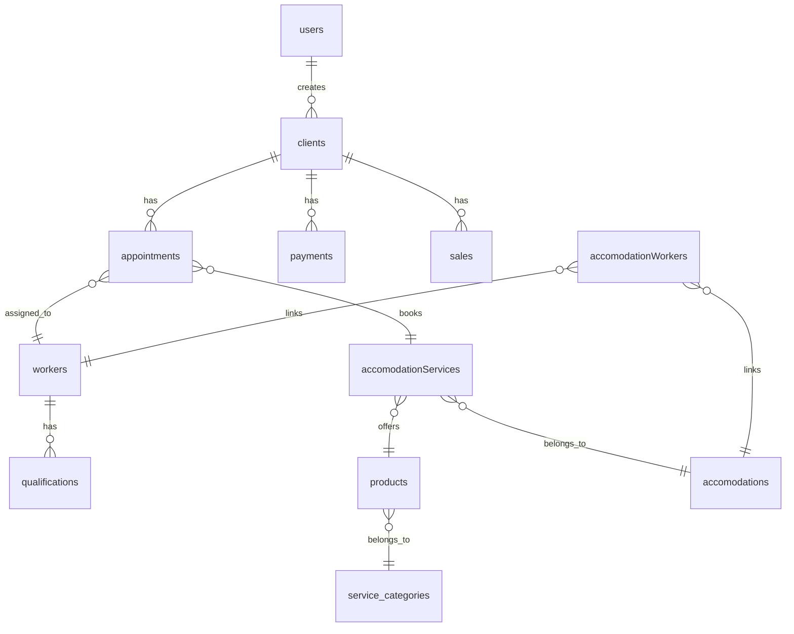

# Riferimento Collections Firestore

Documentazione completa di tutte le 13 collections Firestore del progetto BF Wellness.

## Overview

**Firebase Project**: `bf-wellness-app`
**Region**: europe-west3
**Collections bf-wellness**: 10
**Collections bf-spa**: 13 (10 comuni + 3 aggiuntive)



## Common Collections

### 1. `users`

Profili utenti autenticati (staff).

**Path**: `/users/{userId}`

#### Schema

| Field | Type | Required | Description |
|-------|------|----------|-------------|
| `uid` | `string` | ✅ | Firebase Auth UID |
| `created_time` | `Timestamp` | ✅ | Data creazione account |
| `display_name` | `string` | ❌ | Nome visualizzato |
| `email` | `string` | ✅ | Email utente |
| `phone_number` | `string` | ❌ | Numero telefono |
| `photo_url` | `string` | ❌ | URL foto profilo |
| `last_active_time` | `Timestamp` | ❌ | Ultimo accesso |
| `language` | `string` | ❌ | Lingua preferita (it/en/es) |

#### Esempio JSON

```json
{
  "uid": "abc123xyz",
  "created_time": "2025-01-15T10:30:00Z",
  "display_name": "Mario Rossi",
  "email": "mario.rossi@bfwellness.it",
  "phone_number": "+39 123 456 7890",
  "photo_url": "https://storage.googleapis.com/...",
  "last_active_time": "2025-10-30T14:22:00Z",
  "language": "it"
}
```

#### Security Rules

```javascript
match /users/{document} {
  allow create: if request.auth != null;
  allow read: if request.auth != null;
  allow write: if request.auth != null && request.auth.uid == document;
  allow delete: if false;
}
```

#### Query Helpers

```dart
// Get single user
final user = await UsersRecord.getDocument(userRef);

// Query all users
final users = await queryUsersRecordOnce();
```

---

### 2. `clients`

Anagrafica clienti/ospiti.

**Path**: `/clients/{clientId}`
**Indexed in**: Algolia (`clients` index)

#### Schema

| Field | Type | Required | Description |
|-------|------|----------|-------------|
| `name` | `string` | ✅ | Nome cliente |
| `surname` | `string` | ✅ | Cognome cliente |
| `email` | `string` | ❌ | Email |
| `phone_number` | `string` | ❌ | Telefono |
| `photo_url` | `string` | ❌ | Foto profilo |
| `room_number` | `string` | ❌ | Numero camera (se ospite hotel) |
| `start_of_stay` | `Timestamp` | ❌ | Check-in |
| `end_of_stay` | `Timestamp` | ❌ | Check-out |
| `paid` | `double` | ✅ | Totale pagato |
| `toPay` | `double` | ✅ | Saldo da pagare |
| `created_time` | `Timestamp` | ✅ | Data creazione |
| `created_by` | `DocumentReference` | ✅ | Riferimento a `/users/{userId}` |
| `accomodation` | `DocumentReference` | ❌ | **[bf-spa only]** Riferimento a `/accomodations/{id}` |

#### Esempio JSON

```json
{
  "name": "Laura",
  "surname": "Bianchi",
  "email": "laura.bianchi@example.com",
  "phone_number": "+39 333 1234567",
  "photo_url": null,
  "room_number": "205",
  "start_of_stay": "2025-10-28T14:00:00Z",
  "end_of_stay": "2025-11-02T10:00:00Z",
  "paid": 250.00,
  "toPay": 150.00,
  "created_time": "2025-10-27T16:45:00Z",
  "created_by": "/users/abc123xyz"
}
```

#### Security Rules

```javascript
match /clients/{document} {
  allow create, read: if true;  // ⚠️ Public read!
  allow write: if request.auth != null;
  allow delete: if false;
}
```

<Warning>
  **Security Issue**: `allow read: if true` permette lettura anche senza autenticazione!

  **Fix consigliato**:
  ```javascript
  allow read: if request.auth != null;
  ```
</Warning>

#### Indexes

```json
{
  "collectionGroup": "clients",
  "fields": [
    {"fieldPath": "toPay", "order": "DESCENDING"},
    {"fieldPath": "name", "order": "ASCENDING"},
    {"fieldPath": "surname", "order": "ASCENDING"}
  ]
}
```

#### Query Helpers

```dart
// Search by name (Algolia)
final results = await FFAlgoliaManager.instance
  .algoliaQuery(queryText: 'Laura')
  .getResponse();

// Get clients with debt
final clientsWithDebt = await queryClientsRecordOnce(
  queryBuilder: (q) => q
    .where('toPay', isGreaterThan: 0)
    .orderBy('toPay', descending: true),
);

// Get clients by accommodation (bf-spa only)
final accommodationClients = await queryClientsRecordOnce(
  queryBuilder: (q) => q.where('accomodation', isEqualTo: accommodationRef),
);
```

---

### 3. `appointments`

Prenotazioni servizi/trattamenti.

**Path**: `/appointments/{appointmentId}`

#### Schema

| Field | Type | Required | Description |
|-------|------|----------|-------------|
| `workers` | `List<DocumentReference>` | ✅ | Riferimenti a `/workers/{id}` |
| `client` | `DocumentReference` | ✅ | Riferimento a `/clients/{id}` |
| `startDate` | `Timestamp` | ✅ | Inizio appuntamento |
| `endDate` | `Timestamp` | ✅ | Fine appuntamento |
| `duration` | `int` | ✅ | Durata in minuti |
| `price` | `double` | ✅ | Prezzo servizio |
| `email` | `string` | ❌ | Email cliente (copia) |
| `canceled` | `bool` | ✅ | Flag cancellazione |
| `cancellationReason` | `string` | ❌ | Motivo cancellazione |
| `canceledBy` | `string` | ❌ | Chi ha cancellato |
| `clientData` | `ClientDataStruct` | ✅ | Dati denormalizzati cliente |
| `workersData` | `List<WorkerDataStruct>` | ✅ | Dati denormalizzati operatori |
| `serviceData` | `ServiceDataStruct` | ✅ | Dati denormalizzati servizio |
| `accomodation` | `DocumentReference` | ❌ | **[bf-spa only]** Riferimento struttura |
| `isSecondAgenda` | `bool` | ❌ | **[bf-spa only]** Flag seconda agenda |

#### Struct: ClientDataStruct

```dart
class ClientDataStruct {
  String name;
  String surname;
  String? email;
  String? phoneNumber;
  String? roomNumber;
  String? notes;
}
```

#### Struct: WorkerDataStruct

```dart
class WorkerDataStruct {
  String name;
  String surname;
  String role;
  String? photoUrl;
}
```

#### Struct: ServiceDataStruct

```dart
class ServiceDataStruct {
  String title;
  String? description;
  double price;
  int duration;
  String? category;
  String? imageUrl;
}
```

#### Esempio JSON

```json
{
  "workers": [
    "/workers/worker123",
    "/workers/worker456"
  ],
  "client": "/clients/client789",
  "startDate": "2025-11-05T10:00:00Z",
  "endDate": "2025-11-05T11:30:00Z",
  "duration": 90,
  "price": 120.00,
  "email": "laura.bianchi@example.com",
  "canceled": false,
  "cancellationReason": null,
  "canceledBy": null,
  "clientData": {
    "name": "Laura",
    "surname": "Bianchi",
    "email": "laura.bianchi@example.com",
    "phoneNumber": "+39 333 1234567",
    "roomNumber": "205",
    "notes": "Preferisce musica rilassante"
  },
  "workersData": [
    {
      "name": "Maria",
      "surname": "Verdi",
      "role": "Massaggiatore",
      "photoUrl": "https://..."
    }
  ],
  "serviceData": {
    "title": "Massaggio Rilassante",
    "description": "90 minuti di relax totale",
    "price": 120.00,
    "duration": 90,
    "category": "Massaggi",
    "imageUrl": "https://..."
  }
}
```

<Info>
  **Perché denormalizzazione?** I dati `*Data` sono snapshot al momento della prenotazione.
  Anche se cliente/operatore/servizio cambiano dopo, l'appuntamento mantiene i dati originali.
</Info>

#### Security Rules

```javascript
// bf-wellness
match /appointments/{document} {
  allow create, read: if true;
  allow write: if false;  // ⚠️ Solo via backend!
  allow delete: if false;
}

// bf-spa
match /appointments/{document} {
  allow create, read: if true;
  allow write: if request.auth != null;
  allow delete: if false;
}
```

#### Indexes

```json
[
  {
    "collectionGroup": "appointments",
    "fields": [
      {"fieldPath": "startDate", "order": "ASCENDING"},
      {"fieldPath": "workers", "arrayConfig": "CONTAINS"}
    ]
  },
  {
    "collectionGroup": "appointments",
    "fields": [
      {"fieldPath": "canceled", "order": "ASCENDING"},
      {"fieldPath": "workers", "arrayConfig": "CONTAINS"},
      {"fieldPath": "startDate", "order": "DESCENDING"}
    ]
  },
  {
    "collectionGroup": "appointments",
    "fields": [
      {"fieldPath": "client", "order": "ASCENDING"},
      {"fieldPath": "startDate", "order": "DESCENDING"}
    ]
  }
]
```

#### Query Helpers

```dart
// Appointments for specific worker
final workerAppointments = await queryAppointmentsRecordOnce(
  queryBuilder: (q) => q
    .where('workers', arrayContains: workerRef)
    .where('canceled', isEqualTo: false)
    .orderBy('startDate'),
);

// Appointments for specific client
final clientAppointments = await queryAppointmentsRecordOnce(
  queryBuilder: (q) => q
    .where('client', isEqualTo: clientRef)
    .orderBy('startDate', descending: true),
);

// Appointments for specific date range
final todayAppointments = await queryAppointmentsRecordOnce(
  queryBuilder: (q) => q
    .where('startDate', isGreaterThanOrEqualTo: DateTime(2025, 11, 5))
    .where('startDate', isLessThan: DateTime(2025, 11, 6))
    .orderBy('startDate'),
);
```

---

### 4. `payments`

Tracciamento incassi.

**Path**: `/payments/{paymentId}`

#### Schema

| Field | Type | Required | Description |
|-------|------|----------|-------------|
| `amount` | `double` | ✅ | Importo pagato |
| `date` | `Timestamp` | ✅ | Data pagamento |
| `client` | `DocumentReference` | ✅ | Riferimento `/clients/{id}` |
| `appointment` | `DocumentReference` | ❌ | Riferimento `/appointments/{id}` |
| `paymentMethod` | `string` | ✅ | Metodo: "cash", "card", "bank_transfer", "room_charge" |
| `discount` | `double` | ❌ | Sconto applicato |
| `notes` | `string` | ❌ | Note pagamento |
| `clientData` | `ClientDataStruct` | ✅ | Dati denormalizzati cliente |
| `workerData` | `WorkerDataStruct` | ❌ | Chi ha registrato il pagamento |
| `created_time` | `Timestamp` | ✅ | Timestamp creazione |
| `recorded_by` | `DocumentReference` | ✅ | Riferimento `/users/{id}` |

#### Esempio JSON

```json
{
  "amount": 120.00,
  "date": "2025-11-05T11:45:00Z",
  "client": "/clients/client789",
  "appointment": "/appointments/appt456",
  "paymentMethod": "card",
  "discount": 10.00,
  "notes": "Pagamento con carta Mastercard",
  "clientData": {
    "name": "Laura",
    "surname": "Bianchi",
    "email": "laura.bianchi@example.com",
    "roomNumber": "205"
  },
  "workerData": {
    "name": "Giovanni",
    "surname": "Neri",
    "role": "Reception"
  },
  "created_time": "2025-11-05T11:45:30Z",
  "recorded_by": "/users/user123"
}
```

#### Security Rules

```javascript
match /payments/{document} {
  allow create, read: if true;
  allow write, delete: if false;  // No updates/deletes
}
```

#### Indexes

```json
{
  "collectionGroup": "payments",
  "fields": [
    {"fieldPath": "client", "order": "ASCENDING"},
    {"fieldPath": "date", "order": "DESCENDING"}
  ]
}
```

#### Query Helpers

```dart
// Payments for client
final clientPayments = await queryPaymentsRecordOnce(
  queryBuilder: (q) => q
    .where('client', isEqualTo: clientRef)
    .orderBy('date', descending: true),
);

// Payments by method
final cardPayments = await queryPaymentsRecordOnce(
  queryBuilder: (q) => q
    .where('paymentMethod', isEqualTo: 'card')
    .orderBy('date', descending: true),
);

// Total payments for period
final paymentsThisMonth = await queryPaymentsRecordOnce(
  queryBuilder: (q) => q
    .where('date', isGreaterThanOrEqualTo: DateTime(2025, 11, 1))
    .where('date', isLessThan: DateTime(2025, 12, 1)),
);
```

---

### 5. `workers`

Operatori/staff della struttura.

**Path**: `/workers/{workerId}`

#### Schema

| Field | Type | Required | Description |
|-------|------|----------|-------------|
| `name` | `string` | ✅ | Nome |
| `surname` | `string` | ✅ | Cognome |
| `email` | `string` | ❌ | Email |
| `phone` | `string` | ❌ | Telefono |
| `thumbnail` | `string` | ❌ | URL foto profilo |
| `bio` | `string` | ❌ | Biografia/descrizione |
| `roles` | `List<string>` | ✅ | Ruoli: "massaggiatore", "estetista", "reception", etc. |
| `qualifications` | `List<DocumentReference>` | ❌ | Riferimenti a `/qualifications/{id}` |
| `is_active` | `bool` | ✅ | Flag attivo/disattivo |
| `created_time` | `Timestamp` | ✅ | Data creazione |

#### Esempio JSON

```json
{
  "name": "Maria",
  "surname": "Verdi",
  "email": "maria.verdi@bfwellness.it",
  "phone": "+39 345 6789012",
  "thumbnail": "https://storage.googleapis.com/...",
  "bio": "Massaggiatrice professionista con 10 anni di esperienza",
  "roles": ["massaggiatore", "estetista"],
  "qualifications": [
    "/qualifications/qual123",
    "/qualifications/qual456"
  ],
  "is_active": true,
  "created_time": "2025-01-10T09:00:00Z"
}
```

#### Security Rules

```javascript
match /workers/{document} {
  allow create, read: if true;
  allow write: if false;
  allow delete: if false;
}
```

#### Query Helpers

```dart
// Get active workers
final activeWorkers = await queryWorkersRecordOnce(
  queryBuilder: (q) => q.where('is_active', isEqualTo: true),
);

// Get workers by role
final masseurs = await queryWorkersRecordOnce(
  queryBuilder: (q) => q.where('roles', arrayContains: 'massaggiatore'),
);
```

---

### 6. `products`

Catalogo servizi/prodotti vendibili.

**Path**: `/products/{productId}`

#### Schema

| Field | Type | Required | Description |
|-------|------|----------|-------------|
| `name` | `string` | ✅ | Nome prodotto/servizio |
| `description` | `string` | ❌ | Descrizione |
| `price` | `double` | ✅ | Prezzo |
| `duration` | `int` | ❌ | Durata in minuti (per servizi) |
| `category` | `string` | ❌ | Categoria |
| `image` | `string` | ❌ | URL immagine |
| `tags` | `List<string>` | ❌ | Tags per ricerca |
| `is_active` | `bool` | ✅ | Visibile agli utenti |
| `created_time` | `Timestamp` | ✅ | Data creazione |

#### Query Helpers

```dart
final activeProducts = await queryProductsRecordOnce(
  queryBuilder: (q) => q.where('is_active', isEqualTo: true),
);
```

---

### 7-10. Altri Collections Comuni

**`service_categories`**: Tassonomia servizi
**`qualifications`**: Certificazioni operatori
**`sales`**: Vendite prodotti
**`accomodationServices`**: Servizi per struttura

_Vedi schemi completi nel codice: `lib/backend/schema/`_

---

## bf-spa Exclusive Collections

### 11. `accomodations`

Strutture/hotel multipli (solo bf-spa).

**Path**: `/accomodations/{accomodationId}`

#### Schema

| Field | Type | Required | Description |
|-------|------|----------|-------------|
| `name` | `string` | ✅ | Nome struttura |
| `slug` | `string` | ✅ | URL-friendly identifier |
| `description` | `string` | ❌ | Descrizione |
| `hero` | `string` | ❌ | Immagine principale |
| `gallery` | `List<string>` | ❌ | Galleria immagini |
| `location` | `LatLng` | ❌ | Coordinate GPS |
| `address` | `string` | ❌ | Indirizzo |
| `city` | `string` | ❌ | Città |
| `country` | `string` | ❌ | Paese |
| `phone` | `string` | ❌ | Telefono |
| `email` | `string` | ❌ | Email |
| `timezone` | `string` | ❌ | Timezone (es: "Europe/Rome") |
| `is_active` | `bool` | ✅ | Flag attivo |

---

### 12. `accomodationWorkers`

Relazione operatori-strutture (solo bf-spa).

**Path**: `/accomodationWorkers/{id}`

#### Schema

| Field | Type | Required | Description |
|-------|------|----------|-------------|
| `accomodation` | `DocumentReference` | ✅ | Riferimento `/accomodations/{id}` |
| `worker` | `DocumentReference` | ✅ | Riferimento `/workers/{id}` |
| `roles` | `List<string>` | ✅ | Ruoli in questa struttura |
| `active` | `bool` | ✅ | Flag attivo |
| `startDate` | `Timestamp` | ❌ | Inizio collaborazione |
| `endDate` | `Timestamp` | ❌ | Fine collaborazione |

---

### 13. `training_videos`

Video formativi per staff (solo bf-spa).

**Path**: `/training_videos/{videoId}`

#### Schema

| Field | Type | Required | Description |
|-------|------|----------|-------------|
| `title` | `string` | ✅ | Titolo video |
| `description` | `string` | ❌ | Descrizione |
| `videoUrl` | `string` | ✅ | URL video (YouTube, Vimeo, etc.) |
| `thumbnail` | `string` | ❌ | Thumbnail |
| `duration` | `int` | ❌ | Durata in secondi |
| `tags` | `List<string>` | ❌ | Tags |
| `order` | `int` | ❌ | Ordine visualizzazione |
| `is_featured` | `bool` | ❌ | In evidenza |
| `active` | `bool` | ✅ | Visibile |

---

## Summary Table

| Collection | bf-wellness | bf-spa | Indexed (Algolia) |
|------------|-------------|--------|-------------------|
| `users` | ✅ | ✅ | ❌ |
| `clients` | ✅ | ✅ | ✅ |
| `appointments` | ✅ | ✅ | ❌ |
| `payments` | ✅ | ✅ | ❌ |
| `workers` | ✅ | ✅ | ❌ |
| `products` | ✅ | ✅ | ❌ |
| `service_categories` | ✅ | ✅ | ❌ |
| `qualifications` | ✅ | ✅ | ❌ |
| `sales` | ✅ | ✅ | ❌ |
| `accomodationServices` | ✅ | ✅ | ❌ |
| `accomodations` | ❌ | ✅ | ❌ |
| `accomodationWorkers` | ❌ | ✅ | ❌ |
| `training_videos` | ❌ | ✅ | ❌ |

## Best Practices

<AccordionGroup>
  <Accordion title="Usa Query Helpers invece di Firestore diretto">
    ```dart
    // ✅ GOOD
    final clients = await queryClientsRecordOnce(
      queryBuilder: (q) => q.where('toPay', isGreaterThan: 0),
    );

    // ❌ BAD
    final clients = await FirebaseFirestore.instance
      .collection('clients')
      .where('toPay', isGreaterThan: 0)
      .get();
    ```
  </Accordion>

  <Accordion title="Usa Struct per dati denormalizzati">
    Quando salvi dati che potrebbero cambiare, usa struct per snapshot:

    ```dart
    appointment.clientData = ClientDataStruct(
      name: client.name,
      surname: client.surname,
      email: client.email,
      // ... altri campi
    );
    ```
  </Accordion>

  <Accordion title="Attenzione agli indici">
    Query complesse richiedono indici. Controlla `firebase/firestore.indexes.json` prima di query con:
    - Multipli `where()`
    - `where()` + `orderBy()`
    - `arrayContains` + altri filtri
  </Accordion>

  <Accordion title="Security rules da rivedere">
    **URGENTE**: Molte collection hanno `allow read/create: if true` - troppo permissivo!

    Leggi [Security Rules Guide](/guides/security-rules) per fix.
  </Accordion>
</AccordionGroup>

## Related Documentation

<CardGroup cols={2}>
  <Card title="Security Rules" icon="shield" href="/guides/security-rules">
    Guida completa alle Firestore security rules
  </Card>

  <Card title="Firestore Indexes" icon="list-tree" href="/guides/firestore-indexes">
    Come ottimizzare le query con gli indici
  </Card>

  <Card title="Cloud Functions" icon="bolt" href="/api-reference/cloud-functions">
    Backend logic serverless
  </Card>

  <Card title="Data Model Architecture" icon="diagram-project" href="/architecture/data-model">
    Design patterns e architettura dati
  </Card>
</CardGroup>

---

<Note>
  **Questa reference è basata sul reverse engineering del codice.** Se trovi discrepanze, verifica sempre il codice sorgente in `lib/backend/schema/`.
</Note>
