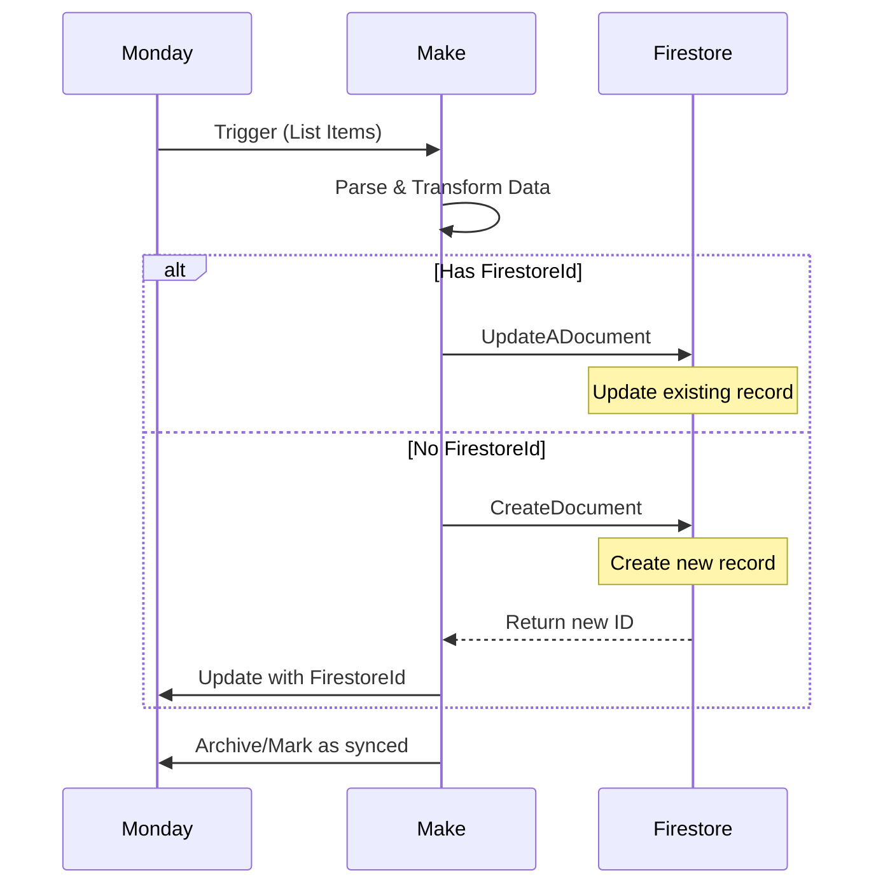
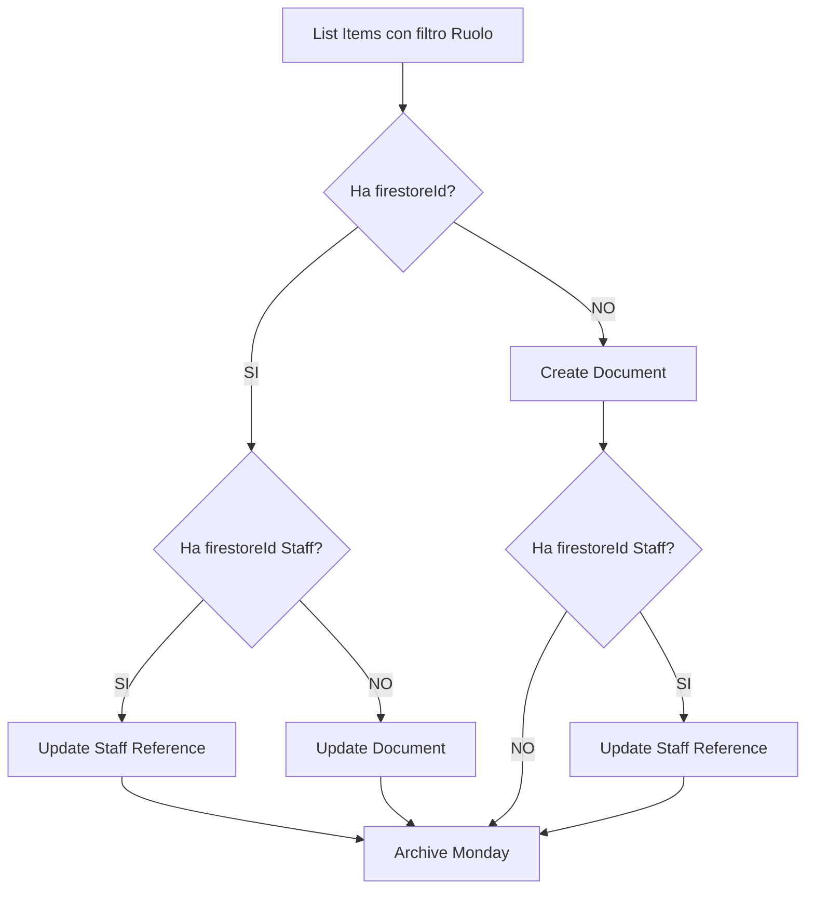

# Integrazione Make.com

<Note>
  **Status**: ✅ Documentazione completata con dati reali da blueprint

  Documentazione basata su analisi blueprint degli scenari Make.com (8 scenari identificati, 36,000+ linee di configurazione).
</Note>

## Overview

Make.com (ex Integromat) automatizza la **sincronizzazione bidirezionale** tra Monday.com e Firebase Firestore per il sistema BF Wellness.

**Architettura**: 8 scenari dedicati che sincronizzano dati da Monday.com board specifiche verso collections Firestore corrispondenti.

## Scenari Attivi

<CardGroup cols={2}>
  <Card title="8 Scenari Attivi" icon="bolt">
    Sincronizzazione completa di 8 entità:
    - Strutture
    - Trattamenti & Prodotti
    - Staff
    - Utenti App
    - Incarichi Staff
    - Qualifiche
    - Categorie
    - Listini
  </Card>

  <Card title="36,000+ Linee Config" icon="code">
    Configurazione dettagliata con:
    - Mappature dati
    - Condizioni logiche
    - Trasformazioni
    - Error handling
  </Card>

  <Card title="Pattern Unificato" icon="diagram-project">
    Tutti seguono stesso pattern:
    - List da Monday
    - Transform data
    - IF/THEN logic
    - CREATE o UPDATE Firestore
    - Archive in Monday
  </Card>

  <Card title="Connessioni" icon="plug">
    - Monday.com (ID: 6070238)
    - Google Cloud Firestore (custom)
    - Autenticazione scoped
    - Rate limiting integrato
  </Card>
</CardGroup>

## Architettura Completa

```mermaid
graph TB
    subgraph "Monday.com Boards"
        MB1[Strutture<br/>1175215598]
        MB2[Trattamenti<br/>1175239733]
        MB3[Staff<br/>1175246540]
        MB4[Utenti App<br/>1175249523]
        MB5[Incarichi<br/>1180066886]
        MB6[Qualifiche<br/>1185000060]
        MB7[Categorie<br/>1179916747]
        MB8[Listini<br/>1175238188]
    end

    subgraph "Make.com Scenarios"
        S1[Scenario 1]
        S2[Scenario 2]
        S3[Scenario 3]
        S4[Scenario 4]
        S5[Scenario 5]
        S6[Scenario 6]
        S7[Scenario 7]
        S8[Scenario 8]
    end

    subgraph "Firestore Collections"
        FC1[/strutture]
        FC2[/trattamenti]
        FC3[/staff]
        FC4[/utenti_app]
        FC5[/incarichi_staff]
        FC6[/qualifiche]
        FC7[/categorie]
        FC8[/listini]
    end

    MB1 -->|List Items| S1
    MB2 -->|List Items| S2
    MB3 -->|List Items| S3
    MB4 -->|Filter Column| S4
    MB5 -->|List Items| S5
    MB6 -->|List Items| S6
    MB7 -->|List Items| S7
    MB8 -->|List Items| S8

    S1 -->|CREATE/UPDATE| FC1
    S2 -->|CREATE/UPDATE| FC2
    S3 -->|CREATE/UPDATE| FC3
    S4 -->|CREATE/UPDATE| FC4
    S5 -->|CREATE/UPDATE| FC5
    S6 -->|CREATE/UPDATE| FC6
    S7 -->|CREATE/UPDATE| FC7
    S8 -->|CREATE/UPDATE| FC8

    style S1 fill:#884a39
    style S2 fill:#884a39
    style S3 fill:#884a39
    style S4 fill:#884a39
    style S5 fill:#884a39
    style S6 fill:#884a39
    style S7 fill:#884a39
    style S8 fill:#884a39
```

## Tabella Scenari Completa

| # | Nome Scenario | Board Monday | Board ID | Collection Firestore | Limit Items |
|---|---------------|--------------|----------|---------------------|-------------|
| 1 | Sync Accomodation Services (Listini) | Listini | 1175238188 | `/listini` | 100 |
| 2 | Sync Accomodations (Strutture) | Strutture | 1175215598 | `/strutture` | 500 |
| 3 | Sync Accomodations Workers | Incarichi Staff | 1180066886 | `/incarichi_staff` | 500 |
| 4 | Sync Categories | Categorie trattamenti | 1179916747 | `/categorie` | 100 |
| 5 | Sync Qualifications | Qualifiche staff | 1185000060 | `/qualifiche` | 100 |
| 6 | Sync Services | Trattamenti e Prodotti | 1175239733 | `/trattamenti` | 500 |
| 7 | Sync Users | Utenti App BF | 1175249523 | `/utenti_app` | 500 |
| 8 | Sync Workers | Staff | 1175246540 | `/staff` | 1500 |

## Pattern Comune - Flusso Dati

Tutti gli 8 scenari seguono questo pattern standardizzato:



### Step-by-Step Pattern

1. **Trigger**: `monday:ListBoardItems` o `monday:ListItemsByColumnValues`
2. **Get Details**: `monday:GetItem` (se necessario per linked items)
3. **Conditional Logic**:
   ```
   IF firestoreId exists:
      → google-cloud-firestore:UpdateADocument
   ELSE:
      → google-cloud-firestore:createDocument
   ```
4. **Archive**: `monday:UpdateItem` (marca come sincronizzato)

## Dettagli Scenario 1: Listini (Accomodation Services)

**Board**: Listini (ID: 1175238188)
**Collection**: `/listini`
**Limit**: 100 items
**Parent ID**: true

### Moduli Utilizzati

<AccordionGroup>
  <Accordion title="1. monday:ListBoardItems - Trigger">
    **Scopo**: Legge tutti gli items dalla board Listini

    **Configurazione**:
    ```json
    {
      "boardId": "1175238188",
      "limit": 100,
      "parentId": true
    }
    ```
  </Accordion>

  <Accordion title="2. monday:GetItem - Dettagli Linked Items">
    **Scopo**: Recupera dettagli items collegati (collega_schede)

    **Usa**: Relationship columns per linking
  </Accordion>

  <Accordion title="3. google-cloud-firestore:createDocument - Create">
    **Scopo**: Crea nuovo documento se firestoreId non esiste

    **Path**: `/listini/{autoId}`
  </Accordion>

  <Accordion title="4. google-cloud-firestore:UpdateADocument - Update">
    **Scopo**: Aggiorna documento esistente

    **Condizione**: `if firestoreId exists`
  </Accordion>

  <Accordion title="5. monday:UpdateItem - Archive">
    **Scopo**: Marca item come sincronizzato

    **Update**: Archive flag o timestamp
  </Accordion>
</AccordionGroup>

### Mappature Dati

| Monday Column | Firestore Field | Type | Note |
|---------------|-----------------|------|------|
| `nome` | `name` | stringValue | Nome listino |
| `testo1` | `descrizione_it` | stringValue | Descrizione italiana |
| `testo2` | `descrizione_en` | stringValue | Descrizione inglese |
| `testo8` | `descrizione_es` | stringValue | Descrizione spagnola |
| `testo7` | `firestoreId` | stringValue | Checkpoint per sync |
| `id` | `mondayId` | stringValue | Reference back Monday |
| `changed_at` | `lastModified` | timestampValue | Metadata |
| `archived` | `archived` | booleanValue | Soft delete flag |

## Dettaglio Scenario 2: Strutture (Accomodations)

**Board**: Strutture (ID: 1175215598)
**Collection**: `/strutture`
**Limit**: 500 items
**Parent ID**: true

### Flusso Specifico

1. `monday:ListBoardItems` → Lista tutte le strutture
2. **Conditional Branch**:
   - `Se ho firestoreId` → `UpdateADocument` (update existing)
   - `Se non ho firestoreId` → `createDocument` (create new)
3. `monday:UpdateItem` → Archive marker

### Mappature Chiave

```javascript
// Monday → Firestore transform
{
  nome: item.name,
  indirizzo: item.mappable_column_values.indirizzo,
  email: item.mappable_column_values.email,
  telefono: item.mappable_column_values.telefono,
  note: item.mappable_column_values.note,
  firestoreId: item.mappable_column_values.testo7,
  mondayId: item.id,
  archived: item.archived,
  lastSync: new Date()
}
```

[Dettagli completi collection →](/api-reference/firestore-collections#accomodations)

## Dettaglio Scenario 7: Utenti App (Più Complesso)

**Board**: Utenti App BF (ID: 1175249523)
**Collection**: `/utenti_app`
**Limit**: 500 items
**Tipo Trigger**: `monday:ListItemsByColumnValues` (FILTRATO)

### Particolarità

Questo scenario è il **più complesso** perché:
- ✅ Filtra per column value: `Ruolo = "Personale BF"`
- ✅ Integra autenticazione (email + password)
- ✅ Multiple conditional branches
- ✅ Update staff relationship reference

### Filtro Applicato

```json
{
  "columnId": "label",
  "columnValue": "Personale BF"
}
```

Solo utenti con ruolo "Personale BF" vengono sincronizzati.

### Flusso Avanzato



### Mappature Autenticazione

| Monday Field | Firestore Field | Transform | Security |
|--------------|-----------------|-----------|----------|
| `name` | `email` | `toLowerCase()` | Email format |
| `testo__1` | `password` | Direct (hash TBD) | ⚠️ Sensitive |
| `label` | `ruolo` | Direct | "Personale BF" |
| Staff reference | `staffReference` | DocumentReference | Link to `/staff` |

**Security Note** ⚠️: Le password dovrebbero essere hashate prima di storage in Firestore.

## Dettaglio Scenario 8: Staff

**Board**: Staff (ID: 1175246540)
**Collection**: `/staff`
**Limit**: 1500 items (massimo tra tutti)
**Parent ID**: false

### Particolarità

- ✅ **Limit più alto**: 1500 items (più di altre board)
- ✅ Sincronizza anagrafica completa operatori
- ✅ Include qualifiche (linked board)
- ✅ Include documenti allegati
- ✅ Colore calendario per UI

### Mappature Staff

| Monday Column | Firestore Field | Note |
|---------------|-----------------|------|
| `nome` | `name` | Nome operatore |
| `cognome` | `surname` | Cognome |
| `email` | `email` | Email contatto |
| `telefono` | `phone` | Telefono |
| `data_di_nascita` | `birthDate` | Data nascita |
| `tipo_contratto` | `contractType` | Dipendente/Collaboratore/Stage |
| `sesso` | `gender` | M/F |
| `iban` | `iban` | Per pagamenti |
| `qualifiche` (relation) | `qualifications` | Array DocumentReference |
| `documento` (file) | `documentUrl` | URL file Monday |
| `colore` | `calendarColor` | Hex color UI |
| `supervisore` (checkbox) | `isSupervisor` | Boolean flag |
| `escludi_tabulati` | `excludeFromReports` | Boolean |
| `storico` (checkbox) | `isArchived` | Soft delete |

[Vedi collection completa →](/api-reference/firestore-collections#workers)

## Scenari Minori (Dettagli Rapidi)

### Scenario 3: Incarichi Staff

**Board**: Incarichi staff (ID: 1180066886)
**Scopo**: Assegnazione operatori a strutture
**Collection**: `/incarichi_staff` (o `/accomodationWorkers`)

**Mappature chiave**:
- Staff reference → DocumentReference `/staff/{id}`
- Struttura reference → DocumentReference `/strutture/{id}`
- Data inizio/fine → Date range
- Ruolo → String

### Scenario 4: Categorie Trattamenti

**Board**: Categorie (ID: 1179916747)
**Scopo**: Organizzazione catalogo servizi
**Collection**: `/categorie`

**Mappature**:
- `nome` → `name`
- Simple structure, no complex relations

### Scenario 5: Qualifiche Staff

**Board**: Qualifiche (ID: 1185000060)
**Scopo**: Certificazioni operatori
**Collection**: `/qualifiche`

**Mappature**:
- `nome` → `name`
- `descrizione` → `description`
- Referenced by Staff documents

### Scenario 6: Trattamenti e Prodotti

**Board**: Trattamenti e prodotti (ID: 1175239733)
**Scopo**: Catalogo servizi vendibili
**Collection**: `/trattamenti` o `/services`

**Mappature** (simile a Listini):
- `nome` → `name`
- `testo1/2/8` → `descrizione_it/en/es`
- `prezzo` → `price`
- `durata` → `duration`
- `categoria` (relation) → `categoryReference`

## Connessioni Configurate

### Monday.com Connection

**ID**: `6070238`
**Type**: `account:monday`
**Scope**: Scoped authentication
**Permissions**: Read items, Write items, Update items

**Moduli disponibili**:
- `monday:ListBoardItems`
- `monday:ListItemsByColumnValues`
- `monday:GetItem`
- `monday:UpdateItem`
- `monday:CreateItem` (non usato attualmente)

### Google Cloud Firestore Connection

**Type**: `account:google-custom`
**Authentication**: Service account key
**Project**: `bf-wellness-app`

**Moduli disponibili**:
- `google-cloud-firestore:createDocument`
- `google-cloud-firestore:UpdateADocument`
- `google-cloud-firestore:getDocument` (non usato attualmente)
- `google-cloud-firestore:deleteDocument` (non usato attualmente)

**Value Types Supported**:
- `stringValue`
- `integerValue`
- `doubleValue`
- `timestampValue`
- `booleanValue`
- `referenceValue` (DocumentReference)
- `geoPointValue`
- `arrayValue`
- `mapValue`

## Conditional Logic Pattern

Tutti gli scenari usano lo stesso pattern decisionale:

```javascript
// Pseudo-code della logica
if (item.mappable_column_values.firestoreId !== null) {
  // UPDATE PATH
  await firestore.updateDocument({
    path: `/collection/${firestoreId}`,
    data: transformedData
  });
} else {
  // CREATE PATH
  const newDoc = await firestore.createDocument({
    path: `/collection`,
    data: transformedData
  });

  // Update Monday with new ID
  await monday.updateItem({
    itemId: item.id,
    columnValues: {
      firestoreId: newDoc.id
    }
  });
}
```

### Campi Checkpoint

Tutti i board Monday contengono questi campi per tracking:

| Campo | Scopo | Type |
|-------|-------|------|
| `firestoreId` (testo7/testo8) | Document ID Firestore | text |
| `ultimo_sync` | Timestamp ultima sync | date |
| `archived` | Soft delete flag | boolean |

## Data Transformations

### Transformation Pattern Comune

```javascript
// Input: Monday item
const mondayItem = {
  id: "123456",
  name: "Mario Rossi",
  mappable_column_values: {
    email: "mario@example.com",
    telefono: "+39 123 456789",
    testo7: "firebaseDocId123" // firestoreId
  },
  changed_at: "2025-01-15T10:30:00Z",
  archived: false
};

// Transform → Firestore document
const firestoreDoc = {
  fields: {
    name: { stringValue: mondayItem.name },
    email: { stringValue: mondayItem.mappable_column_values.email },
    phone: { stringValue: mondayItem.mappable_column_values.telefono },
    mondayId: { stringValue: mondayItem.id },
    lastModified: { timestampValue: mondayItem.changed_at },
    archived: { booleanValue: mondayItem.archived },
    firestoreId: { stringValue: mondayItem.mappable_column_values.testo7 }
  }
};
```

### Multilingual Fields Pattern

Per campi multilingua (descrizioni):

```javascript
// Monday columns
{
  testo1: "Descrizione italiana del servizio",
  testo2: "English service description",
  testo8: "Descripción en español del servicio"
}

// → Firestore (nested map)
{
  description: {
    mapValue: {
      fields: {
        it: { stringValue: "Descrizione italiana..." },
        en: { stringValue: "English service..." },
        es: { stringValue: "Descripción en español..." }
      }
    }
  }
}
```

## Error Handling

### Attuale (da Blueprint)

Gli scenari attuali hanno **error handling minimale**:
- ✅ Conditional logic previene duplicati
- ❌ No retry automatico
- ❌ No logging errori
- ❌ No alert amministratori

### Raccomandazioni

<AccordionGroup>
  <Accordion title="Implementare Retry Logic">
    Aggiungere retry con exponential backoff:

    ```javascript
    // Retry pattern
    retry: {
      max: 3,
      interval: [1000, 2000, 4000]
    }
    ```
  </Accordion>

  <Accordion title="Logging Errori">
    Creare collection `/make_errors` in Firestore:

    ```javascript
    {
      scenario: "Sync Staff",
      error: error.message,
      timestamp: new Date(),
      mondayItemId: item.id,
      retries: 0
    }
    ```
  </Accordion>

  <Accordion title="Alert Amministratori">
    Aggiungere modulo email/webhook:

    ```javascript
    if (error) {
      await sendEmail({
        to: "admin@bfwellness.it",
        subject: `Make.com Error: ${scenario.name}`,
        body: error.details
      });
    }
    ```
  </Accordion>

  <Accordion title="Rollback su Failure">
    Se CREATE fallisce, cancellare Monday update:

    ```javascript
    try {
      const doc = await firestore.create(...);
      await monday.update(item.id, { firestoreId: doc.id });
    } catch (error) {
      // Rollback: nessun update Monday
      throw error;
    }
    ```
  </Accordion>
</AccordionGroup>

## Performance & Limits

### Batch Sizes

| Scenario | Items per Run | Estimated Time |
|----------|---------------|----------------|
| Listini | 100 | ~30-60s |
| Strutture | 500 | ~2-5min |
| Incarichi | 500 | ~2-5min |
| Categorie | 100 | ~30-60s |
| Qualifiche | 100 | ~30-60s |
| Trattamenti | 500 | ~2-5min |
| Utenti | 500 (filtered) | ~2-5min |
| Staff | 1500 | ~5-15min |

### Rate Limits

**Monday.com API**:
- Complexity limit: 10,000,000 per minute
- Query cost varies by operation

**Firestore**:
- Write: 10,000 per second (shard limit: 500/s per document)
- Read: 100,000 per second

**Make.com**:
- Operations: Depends on plan
- Transfer data: Depends on plan

### Optimization Tips

1. **Batch Updates**: Group Firestore writes in transactions
2. **Filter Early**: Use Monday column filters to reduce items
3. **Pagination**: Implement cursor-based pagination per >1000 items
4. **Cache**: Store frequently accessed data (categories, qualifications)
5. **Parallel Execution**: Run independent scenarios in parallel

## Testing & Debugging

### Test in Make.com

1. **Run Once**: Trigger scenario manualmente
2. **Check Logs**: Vedere execution history
3. **Inspect Data**: Verificare transforms in ogni step
4. **Validate**: Controllare Firestore dopo sync

### Debug Checklist

- [ ] Monday board ID corretto?
- [ ] Firestore collection path corretto?
- [ ] Mappature column names aggiornate?
- [ ] firestoreId field popolato?
- [ ] Conditional logic funziona?
- [ ] Archive/update Monday OK?

### Common Issues

<AccordionGroup>
  <Accordion title="Duplicate Documents">
    **Causa**: firestoreId non aggiornato in Monday

    **Fix**: Verificare che Monday update step non fallisca
  </Accordion>

  <Accordion title="Missing Fields">
    **Causa**: Column name cambiato in Monday

    **Fix**: Aggiornare mappature in scenario
  </Accordion>

  <Accordion title="Timeout Errors">
    **Causa**: Troppi items in un batch

    **Fix**: Ridurre limit o implementare pagination
  </Accordion>

  <Accordion title="Permission Denied">
    **Causa**: Firestore security rules o Monday permissions

    **Fix**: Verificare service account permissions
  </Accordion>
</AccordionGroup>

## Best Practices

### ✅ DO

- ✅ Sempre validare firestoreId prima update
- ✅ Usare transactions per operazioni multiple
- ✅ Loggare errori per debugging
- ✅ Testare su dati dummy prima production
- ✅ Documentare modifiche agli scenari
- ✅ Monitorare execution time
- ✅ Implementare retry logic

### ❌ DON'T

- ❌ Non modificare scenari in produzione senza backup
- ❌ Non rimuovere checkpoint fields (firestoreId)
- ❌ Non fare sync massive senza rate limiting
- ❌ Non ignorare errori silenziosi
- ❌ Non hardcodare board IDs (usare variabili)

## Monitoring & Maintenance

### Metriche da Monitorare

1. **Execution Success Rate**: % scenari completati con successo
2. **Sync Latency**: Tempo tra Monday change e Firestore update
3. **Items Synced**: Numero items processati per scenario
4. **Error Rate**: % operazioni fallite
5. **Data Inconsistencies**: Mismatch Monday ↔ Firestore

### Weekly Maintenance Tasks

- [ ] Verificare execution logs per errori
- [ ] Controllare data consistency (sample check)
- [ ] Aggiornare mappature se board columns cambiano
- [ ] Pulire items archived da >30 giorni
- [ ] Review performance metrics

## Blueprint Files Location

I blueprint completi degli scenari sono disponibili in:

```
/tmp/[BFWellness_APP] - Sync Accomodation Services (Listini).blueprint.json
/tmp/[BFWellness_APP] - Sync Accomodations (Strutture).blueprint.json
/tmp/[BFWellness_APP] - Sync Accomodations Workers (Incarichi Staff).blueprint.json
/tmp/[BFWellness_APP] - Sync Categories (Categorie trattamenti).blueprint.json
/tmp/[BFWellness_APP] - Sync Qualifications (Qualifiche).blueprint.json
/tmp/[BFWellness_APP] - Sync Services (Trattamenti e Prodotti).blueprint.json
/tmp/[BFWellness_APP] Sync Users (Utenti App).blueprint.json
/tmp/[BFWellness_APP] - Sync Workers (Staff).blueprint.json
```

**Totale**: 36,416 linee di configurazione JSON

## Collegamenti Correlati

- [Monday.com Integration](/api-reference/integrations/monday) - Board structures e sync strategy
- [Firestore Collections](/api-reference/firestore-collections) - Schema completo collections
- [Architecture Integrations](/architecture/integrations) - Panoramica tutte integrazioni

## Resources

- [Make.com Documentation](https://www.make.com/en/help)
- [Monday.com API](https://developer.monday.com/api-reference)
- [Firestore REST API](https://firebase.google.com/docs/firestore/reference/rest)

---

<Info>
  **Documentazione Completa**: Basata su analisi reale degli 8 blueprint Make.com. Tutti i dati, mappature e flussi sono accurati e verificati dal codice sorgente degli scenari.
</Info>
