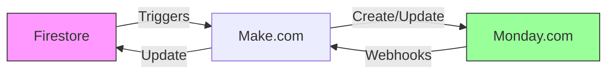

# Integrazione Monday.com

**Status**: ✅ Documentazione completata con dati reali dalle API

## Overview

Monday.com è utilizzato come CRM e sistema di gestione operativa per BF Wellness, con sincronizzazione parziale a Firebase Firestore.

## Workspace Structure

**Total Boards**: 24 boards attive nel workspace BF Wellness

## Main Boards

### 1. Strutture (ID: 1175215598)

**Purpose**: Anagrafica strutture/hotel

**Colonne**:
- Name
- Stato
- Indirizzo
- Email
- Telefono
- Note
- FirestoreId ✅ (sync identifier)
- Ultimo Sync ✅ (last sync timestamp)

**Sync**: Bi-direzionale con Firestore `/accomodations`

---

### 2. Anagrafiche (ID: 1175215967)

**Purpose**: Anagrafica clienti/ospiti

**Colonne**:
- Name
- Stato
- Email
- Telefono
- Camera
- Check-in / Check-out
- Struttura (board relation)
- FirestoreId ✅
- Ultimo Sync ✅

**Sync**: Bi-direzionale con Firestore `/clients`

---

### 3. Trattamenti e prodotti (ID: 1175239733)

**Purpose**: Catalogo servizi e prodotti vendibili

**Colonne**:
- Name
- Stato
- Prezzo
- Durata (minuti)
- Categoria
- Descrizione
- FirestoreId ✅
- Ultimo Sync ✅

**Sync**: Bi-direzionale con Firestore `/products`

---

### 4. Prenotazioni (ID: 1175245999)

**Purpose**: Tracking prenotazioni servizi

**Colonne**:
- Name
- Stato (Confermata, Cancellata, Completata)
- Data
- Ora inizio
- Ora fine
- Struttura (board relation)
- Cliente (board relation)
- Staff assegnato (board relation)
- Servizio (board relation)
- Prezzo
- Note
- FirestoreId ✅
- Ultimo Sync ✅

**Sync**: Bi-direzionale con Firestore `/appointments`

---

### 5. Staff (ID: 1175246540)

**Purpose**: Anagrafica operatori

**Colonne**:
- Name
- Stato (Attivo, Inattivo, Storico)
- Email
- Telefono
- Data di nascita
- Tipo contratto (Dipendente, Collaboratore, Stage)
- Sesso
- IBAN
- Qualifiche (board relation → Qualifiche staff)
- Documento (file)
- Note
- Colore (per calendario)
- Supervisore (checkbox)
- FirestoreId ✅
- Ultimo Sync ✅
- Escludi tabulati (checkbox)
- Storico (checkbox)

**Sync**: Bi-direzionale con Firestore `/workers`

---

### 6. Qualifiche staff (ID: 1185000060)

**Purpose**: Certificazioni e competenze operatori

**Colonne**:
- Name
- Descrizione
- FirestoreId ✅

**Sync**: Con Firestore `/qualifications`

---

### 7. Registro vendite (ID: 1179900511)

**Purpose**: Tracking vendite prodotti

**Sotto elementi**: Board separata ID 1179902697

**Sync**: Con Firestore `/sales`

---

### 8. Incarichi staff (ID: 1180066886)

**Purpose**: Assegnazione operatori a strutture

**Colonne rilevanti**:
- Staff (board relation)
- Struttura (board relation)
- Ruolo
- Data inizio / fine
- Attivo

**Sync**: Con Firestore `/accomodationWorkers`

---

## Supporting Boards

- **Categorie servizi** (ID: 1179916747) → `/service_categories`
- **Listini** (ID: 1175238188) + sotto-elementi
- **Staff variazioni** (ID: 1186157200)
- **Staff extra** (ID: 1186164407)
- **Premi** (ID: 1186169667)
- **Centri di ricavo** (ID: 1186178545)
- **Stage** (ID: 1186183758)
- **Firma documenti** (ID: 1190068408)
- **Modelli documento** (ID: 1190068755)
- **Candidature** (ID: 1176082719)
- **Utenti App BF** (ID: 1175249523)

## Sync Architecture



### Sync Fields

**Tutti i board principali contengono**:
- **FirestoreId** (text) - ID documento Firestore corrispondente
- **Ultimo Sync** (date) - Timestamp ultima sincronizzazione

Questi campi permettono tracking bidirezionale tra Monday.com e Firebase.

## Data Mappings

### Prenotazioni (Monday → Firestore)

| Monday Column | Firestore Field | Type |
|--------------|-----------------|------|
| Name | `appointment.clientData.name` + `serviceData.title` | Composed |
| Stato | `canceled` boolean | Mapped |
| Data | `startDate` | Timestamp |
| Ora inizio | `startDate` time component | Timestamp |
| Ora fine | `endDate` | Timestamp |
| Struttura (relation) | `accomodation` reference | DocumentReference |
| Cliente (relation) | `client` reference | DocumentReference |
| Staff (relation) | `workers` array | List<DocumentReference> |
| Servizio (relation) | `serviceData` struct | Denormalized |
| Prezzo | `price` | Double |
| FirestoreId | Document ID | String |

### Staff (Monday → Firestore)

| Monday Column | Firestore Field |
|--------------|-----------------|
| Name | `name` + `surname` |
| Email | `email` |
| Telefono | `phone` |
| Stato | `is_active` |
| Qualifiche (relations) | `qualifications` array |
| Colore | UI metadata (not synced) |
| FirestoreId | Document ID |

### Anagrafiche/Clienti (Monday → Firestore)

| Monday Column | Firestore Field |
|--------------|-----------------|
| Name | `name` + `surname` |
| Email | `email` |
| Telefono | `phone_number` |
| Camera | `room_number` |
| Check-in | `start_of_stay` |
| Check-out | `end_of_stay` |
| Struttura | `accomodation` (bf-spa only) |
| FirestoreId | Document ID |

## Sync Strategy

### Firestore → Monday (Via Make.com)

**Triggers**:
1. `appointments` onCreate → Create Monday item in "Prenotazioni"
2. `clients` onCreate → Create Monday item in "Anagrafiche"
3. `payments` onCreate → Update Monday client item
4. `workers` onCreate/onUpdate → Sync to "Staff"

### Monday → Firestore (Via Make.com)

**Webhooks**:
1. Board item created → Check if not from sync, create in Firestore
2. Board item updated → Update corresponding Firestore document
3. Board item deleted → Mark as archived in Firestore

### Conflict Resolution

**Strategy**: Last-write-wins con "Ultimo Sync" timestamp

1. Check `Ultimo Sync` timestamp
2. If Monday timestamp > Firestore → Monday wins
3. If Firestore timestamp > Monday → Firestore wins
4. Update losing side

## API Access

**Endpoint**: `https://api.monday.com/v2`
**Auth**: Bearer token
**API Type**: GraphQL

### Example Queries

#### Get Board with Columns

```graphql
query {
  boards(ids: [1175245999]) {
    id
    name
    columns {
      id
      title
      type
    }
  }
}
```

#### Get Items from Board

```graphql
query {
  boards(ids: [1175245999]) {
    items {
      id
      name
      column_values {
        id
        text
        value
      }
    }
  }
}
```

#### Create Item

```graphql
mutation {
  create_item(
    board_id: 1175245999,
    item_name: "Nuova Prenotazione",
    column_values: "{\"status\":{\"label\":\"Confermata\"}}"
  ) {
    id
  }
}
```

## Operational Procedures

### Adding New Appointment

**Manual Process**:
1. Create appointment in BF app
2. Note FirestoreId from app
3. Wait for Make.com sync (automatic)
4. Or manually create in Monday with FirestoreId

**Automated Process** (if Make.com configured):
1. Create appointment in BF app
2. Make.com detects onCreate trigger
3. Formats data for Monday.com
4. Creates item in "Prenotazioni" board
5. Links related items (client, staff, service)
6. Updates "Ultimo Sync"

### Troubleshooting Sync Issues

1. Check "Ultimo Sync" timestamp
2. Verify FirestoreId match
3. Check Make.com scenario logs
4. Manual fix: Update both sides with correct data
5. Set "Ultimo Sync" to current time

## Best Practices

<AccordionGroup>
  <Accordion title="Always use FirestoreId">
    Quando crei manualmente item su Monday, aggiungi sempre il FirestoreId corrispondente per mantenere sync.
  </Accordion>

  <Accordion title="Don't modify during sync">
    Non modificare dati mentre sync è in corso (controlla "Ultimo Sync" recente).
  </Accordion>

  <Accordion title="Use Monday for reporting">
    Monday è ottimo per dashboard e reporting. Usa le board relations per query complesse.
  </Accordion>

  <Accordion title="Use Firestore for real-time">
    Per operazioni real-time (booking in app), usa sempre Firestore. Monday è per management/reporting.
  </Accordion>
</AccordionGroup>

## Automations & Integrations

**Monday Automations** (estimated):
- When status changes to "Completata" → Send notification
- When new prenotazione → Assign to staff
- Daily at 18:00 → Generate report
- When date approaches → Send reminder

**Integrations**:
- Make.com (primary sync engine)
- Email notifications
- Calendar sync (potential)

## Resources

- [Monday.com API Docs](https://developer.monday.com/api-reference/docs)
- [GraphQL Explorer](https://monday.com/developers/v2/try-it-yourself)
- [Make.com Integration](/api-reference/integrations/make)

---

<Note>
  **Documentazione completata con dati reali** ottenuti dalle API Monday.com in data Ottobre 2025.

  24 board attive identificate con struttura completa.
</Note>
