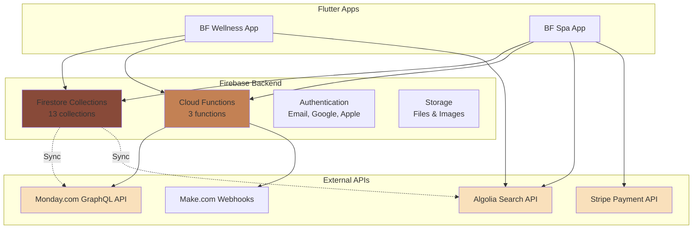

# Panoramica Riferimento API

Questa sezione fornisce la **documentazione tecnica completa** di tutte le API, collections, functions e integrazioni del sistema BF Wellness.

## API Disponibili

<CardGroup cols={2}>
  <Card title="Collections Firestore" icon="database" href="/api-reference/firestore-collections">
    Schema completo 13 collections

    **Contiene**:
    - Schema fields con tipi
    - Esempi JSON
    - Security rules
    - Query helpers comuni
    - Composite indexes

    **Collections**: users, clients, appointments, workers, products, services, payments, sales, e altro

    **Status**: ✅ Documentazione completa
  </Card>

  <Card title="Cloud Functions" icon="bolt" href="/api-reference/cloud-functions">
    Serverless functions Firebase

    **Contiene**:
    - `onUserDeleted` - Cleanup cascata
    - `initStripePayment` - Payment intent
    - `initStripeTestPayment` - Test mode

    **Runtime**: Node.js
    **Triggers**: HTTP, Firestore, Auth

    **Status**: ✅ 3 functions documentate
  </Card>

  <Card title="Custom Actions" icon="code" href="/api-reference/custom-actions">
    Azioni personalizzate Flutter

    **Contiene**:
    - `generate_day_time_slot` - Generazione slot
    - `extract_appointment_from_json` - Parsing dati
    - Custom logic business

    **Locazione**: `/lib/custom_code/actions/`

    **Status**: ✅ Principali documentate
  </Card>

  <Card title="Integrazioni Esterne" icon="plug" href="/api-reference/integrations/monday">
    Monday.com, Make.com, Algolia, Stripe

    **Servizi**:
    - Monday.com (24 boards)
    - Make.com (automazioni)
    - Algolia (ricerca)
    - Stripe (pagamenti)

    **Status**: ✅ Monday.com completo, Make.com parziale
  </Card>
</CardGroup>

## Architettura API



## Collections Firestore - Overview

### Core Collections (Tutte le App)

| Collection | Scopo | Documenti Tipici | Relazioni |
|------------|-------|------------------|-----------|
| `/users` | Autenticazione e profili utenti | ~100-1000 | → accomodations |
| `/clients` | Anagrafica clienti/ospiti | ~5000-50000 | → accomodations, appointments |
| `/appointments` | Prenotazioni trattamenti | ~1000-10000/mese | → clients, workers, services |
| `/workers` | Anagrafica operatori/staff | ~10-100 | → accomodations, qualifications |
| `/products` | Catalogo prodotti vendibili | ~50-500 | → accomodations |
| `/services` | Catalogo servizi/trattamenti | ~20-200 | → accomodations, categories |
| `/payments` | Registrazione pagamenti | ~1000-10000/mese | → clients, appointments |
| `/sales` | Vendite prodotti | ~500-5000/mese | → clients, products |

### Collections Specifiche bf-spa

| Collection | Scopo | Note |
|------------|-------|------|
| `/accomodations` | Strutture/Hotels | Solo bf-spa (multi-sede) |
| `/accomodationWorkers` | Assegnazioni operatori | Mapping workers → structures |
| `/service_categories` | Categorie servizi | Organizzazione catalogo |

[Riferimento completo →](/api-reference/firestore-collections)

## Cloud Functions - Overview

### 1. `onUserDeleted` (Trigger: Auth)

**Scopo**: Cleanup automatico quando un utente viene eliminato

**Trigger**: `functions.auth.user().onDelete()`

**Operazioni**:
- Elimina documento `/users/{userId}`
- Elimina foto profilo da Storage
- (Potenzialmente) anonimizza dati correlati

**Esempio trigger**:
```typescript
// Automatic - triggered when user deleted from Firebase Auth
// No manual invocation needed
```

### 2. `initStripePayment` (HTTP Callable)

**Scopo**: Crea PaymentIntent Stripe per pagamenti online

**Input**:
```typescript
{
  amount: number  // in centesimi (es. 10000 = 100€)
}
```

**Output**:
```typescript
{
  clientSecret: string  // Per Stripe SDK
  paymentIntentId: string
}
```

**Esempio chiamata**:
```dart
final callable = FirebaseFunctions.instance
  .httpsCallable('initStripePayment');
final result = await callable.call({'amount': 10000});
final clientSecret = result.data['clientSecret'];
```

### 3. `initStripeTestPayment` (HTTP Callable)

**Scopo**: Test mode per pagamenti Stripe

**Differenze**: Usa Stripe test keys, non processa pagamenti reali

[Riferimento completo →](/api-reference/cloud-functions)

## Custom Actions - Overview

### `generate_day_time_slot`

**Scopo**: Genera slot orari disponibili per prenotazioni

**Input**:
- `date`: Data da generare
- `duration`: Durata slot (minuti)
- `startHour`, `endHour`: Orario operativo

**Output**: List di TimeSlot objects

**Uso tipico**: Calendar view per selezionare orario prenotazione

### `extract_appointment_from_json`

**Scopo**: Parsing JSON → AppointmentRecord object

**Input**: JSON string
**Output**: Structured AppointmentRecord

**Uso tipico**: Import dati da sistemi esterni

[Riferimento completo →](/api-reference/custom-actions)

## Integrazioni Esterne

### Monday.com (CRM)

**API Type**: GraphQL
**Endpoint**: `https://api.monday.com/v2`
**Auth**: Bearer token

**Board Principali**:
- **Strutture** (ID: 1175215598) ↔ `/accomodations`
- **Anagrafiche** (ID: 1175215967) ↔ `/clients`
- **Prenotazioni** (ID: 1175245999) ↔ `/appointments`
- **Staff** (ID: 1175246540) ↔ `/workers`
- + 20 board di supporto

**Sync Strategy**: Bi-direzionale via Make.com

**Esempio query**:
```graphql
query {
  boards(ids: [1175245999]) {
    items {
      id
      name
      column_values {
        id
        text
        value
      }
    }
  }
}
```

[Documentazione completa →](/api-reference/integrations/monday)

### Make.com (Automazioni)

**Scopo**: Sincronizzazione Firestore ↔ Monday.com

**Scenarios**:
- Firestore onCreate → Monday.com create item
- Firestore onUpdate → Monday.com update item
- Monday.com webhook → Firestore update

**Status**: ⚠️ Token API non valido (documentazione parziale)

[Documentazione parziale →](/api-reference/integrations/make)

### Algolia (Ricerca Full-Text)

**Application ID**: `JQA9QP4JNP`

**Indici**:
- `clients`: Ricerca clienti per nome, email, telefono

**Integrazione Flutter**:
```dart
final results = await FFAlgoliaManager.instance
  .algoliaQuery(
    index: 'clients',
    queryText: 'mario rossi',
  )
  .getResponse();
```

**Sync**: Automatica via Firebase Extension (probabilmente)

### Stripe (Pagamenti Online)

**Uso**: Solo in bf-spa per pagamenti ospiti

**Integration Flow**:
1. App → Cloud Function `initStripePayment`
2. Cloud Function → Stripe API (create PaymentIntent)
3. Stripe → App (clientSecret)
4. App → Stripe SDK (payment sheet)
5. User completa pagamento
6. App → Firestore (salva payment record)

**Package**: `flutter_stripe: 11.1.0`

## Query Patterns Comuni

### Pattern 1: Fetch con Relazioni

```dart
// BAD: Multiple queries (N+1 problem)
final appointments = await queryAppointmentsRecord();
for (var apt in appointments) {
  final client = await apt.client!.get();  // ❌ N queries!
}

// GOOD: Denormalized data
final appointments = await queryAppointmentsRecord();
for (var apt in appointments) {
  final clientName = apt.clientData.name;  // ✅ Already available
}
```

### Pattern 2: Filtered Query con Indice

```dart
// Query con filtri multipli (richiede composite index)
final appointments = await queryAppointmentsRecord(
  queryBuilder: (q) => q
    .where('accomodation', isEqualTo: currentAccomodationRef)
    .where('canceled', isEqualTo: false)
    .where('startDate', isGreaterThanOrEqualTo: DateTime.now())
    .orderBy('startDate'),
);
```

**Richiede indice**: `accomodation ASC, canceled ASC, startDate ASC`

### Pattern 3: Pagination

```dart
DocumentSnapshot? lastDocument;

Future<List<ClientsRecord>> loadMore() async {
  var query = queryClientsRecord(
    queryBuilder: (q) => q.orderBy('createdTime', descending: true).limit(20),
  );

  if (lastDocument != null) {
    query = query.startAfterDocument(lastDocument!);
  }

  final results = await query.get();
  if (results.docs.isNotEmpty) {
    lastDocument = results.docs.last;
  }

  return results.docs.map((doc) => ClientsRecord.fromSnapshot(doc)).toList();
}
```

### Pattern 4: Real-time Updates

```dart
// StreamBuilder per dati live
StreamBuilder<List<AppointmentsRecord>>(
  stream: queryAppointmentsRecord(
    queryBuilder: (q) => q
      .where('startDate', isGreaterThanOrEqualTo: DateTime.now())
      .orderBy('startDate')
      .limit(50),
  ),
  builder: (context, snapshot) {
    if (!snapshot.hasData) return LoadingWidget();

    final appointments = snapshot.data!;
    return ListView.builder(
      itemCount: appointments.length,
      itemBuilder: (context, index) => AppointmentTile(appointments[index]),
    );
  },
)
```

## Security Considerations

### Firestore Security Rules

**Principio base**: Deny by default, allow esplicitamente

```javascript
// ❌ BAD: Troppo permissivo
match /appointments/{document} {
  allow read, write: if true;  // CHIUNQUE può accedere!
}

// ✅ GOOD: Solo utenti autenticati della stessa struttura
match /appointments/{document} {
  allow read: if request.auth != null
    && request.auth.token.accomodation == resource.data.accomodation;
  allow create: if request.auth != null
    && request.auth.token.accomodation == request.resource.data.accomodation;
  allow update, delete: if request.auth != null
    && request.auth.token.accomodation == resource.data.accomodation
    && request.auth.uid == resource.data.createdBy;
}
```

**Issue attuali**: Molte collections hanno rules troppo permissive

[Guida completa →](/guides/security-rules)

### API Keys & Secrets

**Gestione corretta**:
- ✅ Cloud Functions environment variables
- ✅ Flutter `--dart-define` per build
- ✅ Never commit secrets to git
- ❌ Non hardcodare keys nel codice

## Rate Limits & Quotas

### Firebase Firestore

| Operazione | Limit | Note |
|------------|-------|------|
| Letture | 50,000/giorno (Spark plan) | Passa a Blaze per unlimited |
| Scritture | 20,000/giorno (Spark plan) | Passa a Blaze per unlimited |
| Query concorrenti | Unlimited | Ma soggette a rate limit |
| Document size | 1 MB | Include subcollections |

### Cloud Functions

| Metrica | Spark (Free) | Blaze (Pay-as-you-go) |
|---------|--------------|------------------------|
| Invocazioni | 125,000/mese | Unlimited (pricing per invocation) |
| GB-seconds | 40,000/mese | Unlimited |
| CPU-seconds | 40,000/mese | Unlimited |
| Outbound data | 5 GB/mese | Unlimited |

### Algolia

| Piano | Requests/mese | Records |
|-------|---------------|---------|
| Free | 10,000 | 10,000 |
| Grow | Custom | Custom |

### Stripe

**Commissioni**:
- EU cards: 1.5% + €0.25
- Non-EU cards: 2.9% + €0.25

## Errori Comuni & Soluzioni

<AccordionGroup>
  <Accordion title="Permission Denied Error">
    **Errore**: `PERMISSION_DENIED: Missing or insufficient permissions`

    **Cause**:
    - Security rules troppo restrittive
    - User non autenticato
    - Token scaduto

    **Soluzioni**:
    1. Verifica rules in Firebase Console
    2. Check `FirebaseAuth.instance.currentUser`
    3. Forza refresh token
    4. Test con Firebase Emulator
  </Accordion>

  <Accordion title="Query Richiede Indice">
    **Errore**: `The query requires an index`

    **Causa**: Firestore ha bisogno di indice composito per query complessa

    **Soluzione**:
    1. Click sul link nell'errore (crea indice automaticamente)
    2. Oppure aggiungi manualmente a `firestore.indexes.json`
    3. Deploy: `firebase deploy --only firestore:indexes`
  </Accordion>

  <Accordion title="Cloud Function Timeout">
    **Errore**: `Function execution took too long`

    **Causa**: Function execution > 60s (default timeout)

    **Soluzioni**:
    1. Aumenta timeout in function config (max 540s)
    2. Ottimizza query Firestore (usa indici)
    3. Processa in background con Task Queue
    4. Split in multiple smaller functions
  </Accordion>

  <Accordion title="Stripe Payment Failed">
    **Errore**: Various Stripe errors

    **Cause comuni**:
    - Card declined
    - Insufficient funds
    - Test card in production mode
    - Missing 3D Secure

    **Debug**:
    1. Check Stripe Dashboard logs
    2. Verifica test vs live mode
    3. Test con carte ufficiali Stripe
  </Accordion>
</AccordionGroup>

## Testing APIs

### Firebase Emulator

```bash
# Start emulator suite
firebase emulators:start

# Con UI
firebase emulators:start --import=./emulator-data --export-on-exit

# Solo Firestore
firebase emulators:start --only firestore
```

**Vantaggi**:
- ✅ Test senza toccare production data
- ✅ Security rules testing
- ✅ Cloud functions debugging
- ✅ Fast iteration

### Postman Collections

**Collection suggerita** (da creare):
- Cloud Functions HTTP endpoints
- Monday.com GraphQL queries
- Stripe API calls

### Integration Tests

```dart
// Example integration test
testWidgets('Create appointment flow', (tester) async {
  // Setup Firebase emulator
  await Firebase.initializeApp();
  FirebaseFirestore.instance.useFirestoreEmulator('localhost', 8080);

  // Run test
  await tester.pumpWidget(MyApp());
  await tester.tap(find.text('Nuova Prenotazione'));
  await tester.pumpAndSettle();

  // Verify
  expect(find.text('Cliente'), findsOneWidget);
});
```

## Risorse per API Reference

<CardGroup cols={2}>
  <Card title="Firebase REST API" icon="fire" href="https://firebase.google.com/docs/reference/rest">
    REST API reference completa
  </Card>
  <Card title="Monday.com API" icon="calendar" href="https://developer.monday.com/api-reference">
    GraphQL API playground
  </Card>
  <Card title="Stripe API" icon="credit-card" href="https://stripe.com/docs/api">
    Comprehensive Stripe docs
  </Card>
  <Card title="Algolia API" icon="magnifying-glass" href="https://www.algolia.com/doc/api-reference/">
    Search API reference
  </Card>
</CardGroup>

## Versioning & Changelog

**Collections Schema**: Nessun versioning formale attualmente

**Best Practice suggerita**:
- Documentare breaking changes
- Migration scripts per modifiche schema
- Backward compatibility quando possibile

---

<Info>
  **Prossimo Passo**: Per dettagli completi sulle collections Firestore, vai a [Riferimento Collections](/api-reference/firestore-collections).
</Info>
