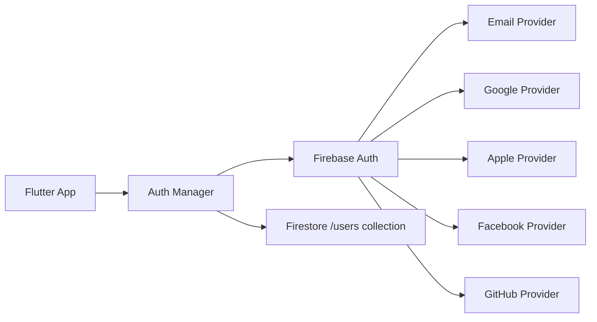
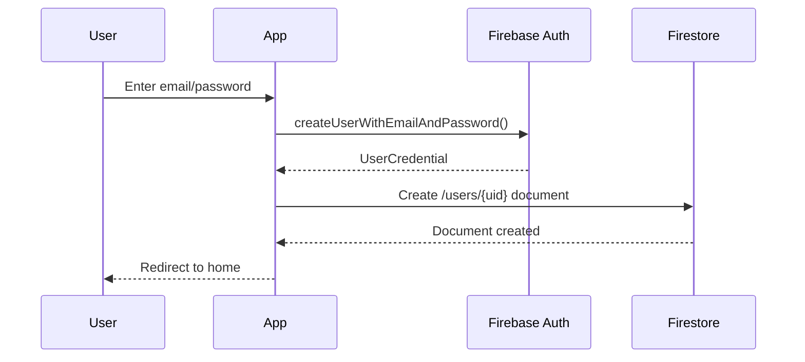
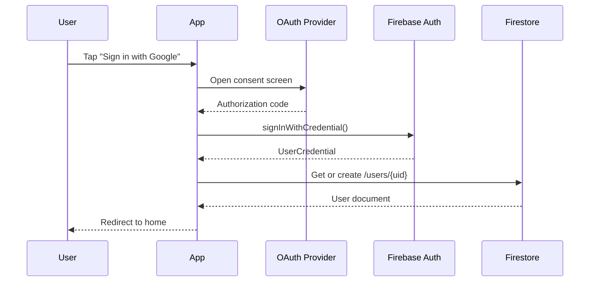

# Autenticazione

Sistema di autenticazione Firebase nel progetto BF Wellness.

## Overview

**Provider**: Firebase Authentication
**Supported Methods**:
- Email/Password
- Google
- Apple
- Facebook
- GitHub
- Anonymous (development)

## Architecture



## Code Structure

```
lib/auth/
├── auth_manager.dart                # Orchestrator
├── base_auth_user_provider.dart    # Base interface
└── firebase_auth/
    ├── auth_util.dart              # Helper functions
    ├── firebase_auth_manager.dart  # Firebase integration
    ├── firebase_user_provider.dart # User state provider
    ├── email_auth.dart             # Email/Password
    ├── google_auth.dart            # Google Sign-In
    ├── apple_auth.dart             # Apple Sign-In
    ├── facebook_auth.dart          # Facebook Login
    ├── github_auth.dart            # GitHub OAuth
    ├── anonymous_auth.dart         # Anonymous (test)
    └── jwt_token_auth.dart         # JWT handling
```

## User Flow

### Sign Up (Email)



### Sign In (Social)



## Usage Examples

### Check Auth State

```dart
import 'package:provider/provider.dart';
import '../auth/firebase_auth/auth_util.dart';

// In widget
@override
Widget build(BuildContext context) {
  final currentUser = Provider.of<BaseAuthUser?>(context);

  if (currentUser == null) {
    return SignInWidget();
  }

  return HomeWidget();
}
```

### Get Current User

```dart
import '../auth/firebase_auth/auth_util.dart';

// Anywhere in app
final user = currentUserUid;  // String: Firebase UID
final email = currentUserEmail;
final displayName = currentUserDisplayName;
final photoUrl = currentUserPhoto;
```

### Sign Out

```dart
await authManager.signOut();
context.go('/SignIn');  // Navigate to sign in
```

## Security

### Firebase Auth Rules

Configurate in Firebase Console > Authentication > Settings

**Email Enumeration Protection**: ✅ Abilitata
**Password Policy**: Min 6 characters (default)

### Firestore User Document

Creato automaticamente al sign up:

```javascript
// firestore.rules
match /users/{userId} {
  allow create: if request.auth != null;
  allow read: if request.auth != null;
  allow write: if request.auth != null && request.auth.uid == userId;
  allow delete: if false;
}
```

### Cloud Function: onUserDeleted

Cleanup automatico quando user viene cancellato:

```javascript
exports.onUserDeleted = functions.auth.user().onDelete((user) => {
  return admin.firestore()
    .collection('users')
    .doc(user.uid)
    .delete();
});
```

## Provider Setup

### Google Sign-In

**Requirements**:
- OAuth 2.0 Client ID configurato in Google Cloud Console
- `google-services.json` (Android)
- `GoogleService-Info.plist` (iOS)

**Config**:
```dart
// Already configured in pubspec.yaml
google_sign_in: 6.1.5  # bf-wellness
google_sign_in: 6.2.1  # bf-spa
```

### Apple Sign-In

**Requirements**:
- Apple Developer Account
- App ID con Sign in with Apple capability
- Service ID configurato

**Config**:
```dart
sign_in_with_apple: 4.3.0  # bf-wellness
sign_in_with_apple: 6.1.2  # bf-spa
```

### Facebook Login

**Requirements**:
- Facebook App ID
- OAuth redirect URI configurato

**Config**:
```dart
flutter_facebook_auth: 4.0.0  # bf-wellness only
```

<Note>
  bf-spa non ha Facebook auth configurato (dependency mancante)
</Note>

## Common Issues

<AccordionGroup>
  <Accordion title="Google Sign-In fails on iOS">
    **Fix**: Verifica che `GoogleService-Info.plist` sia in `ios/Runner/`
    
    ```bash
    cd ios
    pod install
    cd ..
    flutter clean
    flutter run
    ```
  </Accordion>

  <Accordion title="Apple Sign-In not working">
    **Fix**: Verifica capability in Xcode

    1. Open `ios/Runner.xcworkspace`
    2. Select Runner target
    3. Signing & Capabilities
    4. Add "Sign in with Apple"
  </Accordion>

  <Accordion title="User document not created">
    **Fix**: Check Cloud Function `onUserDeleted` is deployed

    ```bash
    firebase deploy --only functions:onUserDeleted
    ```
  </Accordion>
</AccordionGroup>

## Related

<CardGroup cols={2}>
  <Card title="Firestore Users Collection" icon="database" href="/api-reference/firestore-collections#users">
    Schema completo collection users
  </Card>

  <Card title="Security Rules" icon="shield" href="/guides/security-rules">
    Guida completa security rules
  </Card>
</CardGroup>
