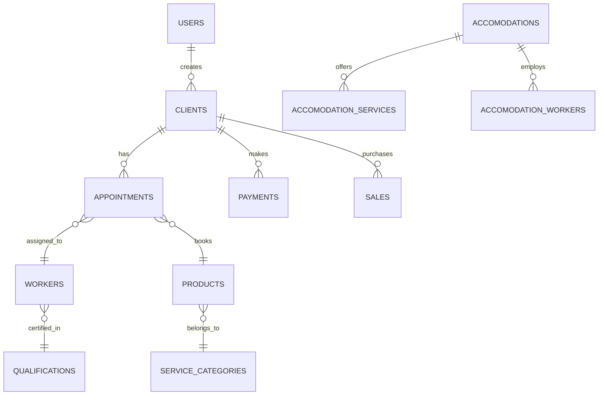
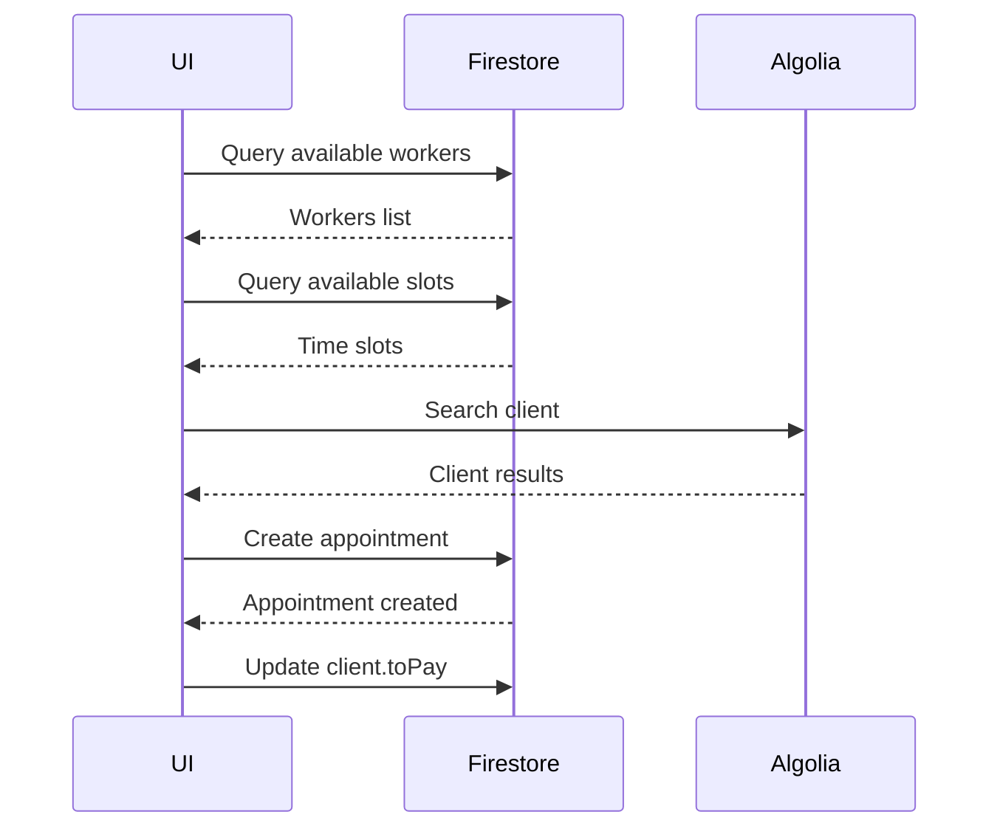
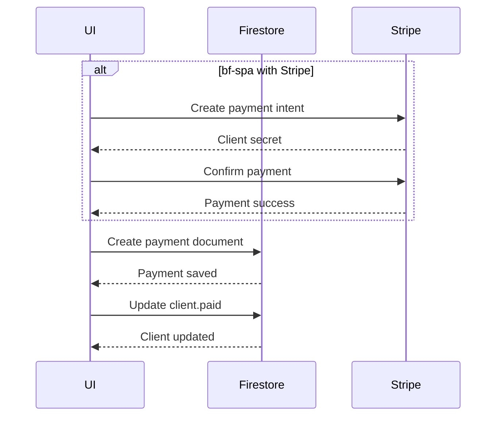

# Modello Dati

Schema e patterns dei dati Firestore nel progetto BF Wellness.

<Info>
  Questa pagina è un'overview concettuale. Per il reference completo di ogni collection vedi [Firestore Collections API Reference](/api-reference/firestore-collections).
</Info>

## Entity Relationship Diagram



## Design Patterns

### 1. Data Denormalization

**Pattern**: Snapshot dati al momento della creazione

**Example**: `appointments` collection

```dart
class AppointmentsRecord {
  // Riferimenti (possono cambiare)
  DocumentReference client;
  List<DocumentReference> workers;

  // Dati denormalizzati (snapshot fisso)
  ClientDataStruct clientData;
  List<WorkerDataStruct> workersData;
  ServiceDataStruct serviceData;
}
```

**Rationale**:
- ✅ Performance: no join queries
- ✅ Data integrity: storico immutabile
- ⚠️ Storage: più spazio utilizzato
- ⚠️ Consistency: dati possono divergere

### 2. Reference vs Embedded

| Usa Reference | Usa Embedded/Struct |
|---------------|---------------------|
| Dati che cambiano frequentemente | Snapshot storici |
| Entità condivise tra documenti | Dati specifici del documento |
| Quando serve query su quella collection | Quando è sempre letto insieme al parent |

**Example**:

```dart
// ✅ Reference: client può cambiare
appointment.client = DocumentReference('/clients/123');

// ✅ Embedded: snapshot al momento booking
appointment.clientData = ClientDataStruct(
  name: 'Laura',
  surname: 'Bianchi',
  roomNumber: '205'
);
```

### 3. Calculated Fields

**Pattern**: Campi calcolati salvati su Firestore

**Example**: `clients.toPay` e `clients.paid`

```dart
// Quando si crea un pagamento:
await FirebaseFirestore.instance.runTransaction((transaction) async {
  // 1. Crea payment
  transaction.set(paymentRef, paymentData);

  // 2. Aggiorna client
  transaction.update(clientRef, {
    'paid': FieldValue.increment(paymentAmount),
    'toPay': FieldValue.increment(-paymentAmount),
  });
});
```

**Rationale**:
- ✅ Performance: no aggregation queries
- ✅ UX: dato disponibile immediatamente
- ⚠️ Consistency: rischio errori se non atomic

## Collections Deep Dive

### Core Collections

1. **users** - Utenti autenticati (staff)
2. **clients** - Anagrafica clienti/ospiti
3. **appointments** - Prenotazioni servizi
4. **payments** - Incassi
5. **workers** - Operatori
6. **products** - Catalogo servizi/prodotti

[Complete reference →](/api-reference/firestore-collections)

### Supporting Collections

7. **service_categories** - Tassonomia servizi
8. **qualifications** - Certificazioni operatori
9. **sales** - Vendite prodotti
10. **accomodationServices** - Servizi per struttura

### bf-spa Exclusive

11. **accomodations** - Strutture multiple
12. **accomodationWorkers** - Operatori per struttura
13. **training_videos** - Video formativi

## Data Flows

### Booking Flow



### Payment Flow



## Indexes Strategy

### Composite Indexes

bf-wellness: **8 indici**
bf-spa: **17 indici**

**Most Important**:

```json
{
  "collectionGroup": "appointments",
  "fields": [
    {"fieldPath": "canceled", "order": "ASCENDING"},
    {"fieldPath": "workers", "arrayConfig": "CONTAINS"},
    {"fieldPath": "startDate", "order": "DESCENDING"}
  ]
}
```

**Why**: Supporta query per agenda operatore filtrata per appuntamenti non cancellati

[Complete indexes guide →](/guides/firestore-indexes)

## Security Model

### Principle: Defense in Depth

1. **Firebase Auth**: Verificare utente autenticato
2. **Security Rules**: Validare permessi a livello documento
3. **App Logic**: Validare input client-side

### Current Issues

<Warning>
  Molte collection hanno `allow read/create: if true` - **troppo permissivo!**

  [Security fixes →](/guides/security-rules)
</Warning>

## Best Practices

<AccordionGroup>
  <Accordion title="Use Transactions for Related Writes">
    ```dart
    await FirebaseFirestore.instance.runTransaction((transaction) async {
      transaction.set(paymentRef, paymentData);
      transaction.update(clientRef, {
        'paid': FieldValue.increment(amount)
      });
    });
    ```
  </Accordion>

  <Accordion title="Denormalize Read-Heavy Data">
    Se dati letti frequentemente insieme → denormalizza

    **Example**: `clientData` in `appointments`
  </Accordion>

  <Accordion title="Use Batched Writes When Possible">
    ```dart
    final batch = FirebaseFirestore.instance.batch();
    batch.set(ref1, data1);
    batch.update(ref2, data2);
    await batch.commit();
    ```
  </Accordion>

  <Accordion title="Avoid Deep Nesting">
    Firestore supporta max 100 livelli di nesting, ma > 3 è antipattern

    **Bad**: `/clients/{id}/appointments/{id}/payments/{id}`
    **Good**: `/payments/{id}` con riferimento a client
  </Accordion>
</AccordionGroup>

## Migration Considerations

Se in futuro serve migrare da Firestore:

**Facilmente portabili**:
- Logica business (se separata da Firestore)
- UI Flutter (indipendente da backend)

**Difficili da portare**:
- Security rules (specifiche Firestore)
- Cloud Functions triggers
- Real-time listeners
- Transazioni atomiche

**Recommendation**: Introduce Repository pattern per astrazione database

---

<Card title="API Reference Completo" icon="book" href="/api-reference/firestore-collections">
  Schema dettagliato di tutte le 13 collections
</Card>
