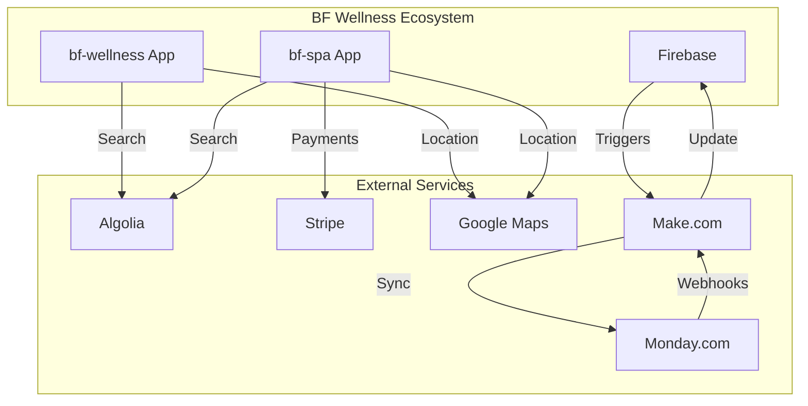

# Integrazioni

Panoramica di tutte le integrazioni esterne del sistema BF Wellness.

## Integration Map



## Firebase

**Purpose**: Backend as a Service (BaaS)
**Components Used**:
- Firestore (Database)
- Authentication
- Cloud Storage
- Cloud Functions (bf-spa only)
- Crashlytics (bf-spa only)

**Configuration**:
- Project ID: `bf-wellness-app`
- Region: europe-west3

[Complete docs →](/api-reference/firestore-collections)

## Algolia

**Purpose**: Full-text search

**Index**: `clients`
**Searchable Fields**: name, surname, email, phone

**Configuration**:
```dart
// lib/backend/algolia/algolia_manager.dart
applicationId: 'JQA9QP4JNP'
apiKey: '3c3c7587c05000f81da86b8f4d3140ec'
```

**Usage**:
```dart
final results = await FFAlgoliaManager.instance
  .algoliaQuery(queryText: 'Laura')
  .getResponse();
```

[Setup guide →](/guides/algolia-search)

## Stripe

**Purpose**: Online payment processing
**App**: bf-spa only

**Integration**: Cloud Functions

```javascript
// firebase/functions/index.js
exports.initStripePayment = functions.https.onCall(async (data) => {
  const paymentIntent = await stripe.paymentIntents.create({
    amount: data.amount,
    currency: 'eur',
    customer: customerId,
  });
  return { clientSecret: paymentIntent.client_secret };
});
```

[Payment flow →](/features/payments/stripe-integration)

## Google Maps

**Purpose**: Location search, maps display

**APIs Used**:
- Maps JavaScript API (Web)
- Maps SDK for Android
- Maps SDK for iOS
- Places API (search)
- Geolocation API

**Configuration**: API key configurata in Firebase console

**Usage**:
```dart
GoogleMap(
  initialCameraPosition: CameraPosition(
    target: LatLng(lat, lng),
    zoom: 14.0,
  ),
)
```

## Make.com

**Purpose**: Workflow automation

**Status**: ✅ Documentato

**Scenari Attivi**:
1. Sincronizzazione Master Data (8 scenari: categorie, servizi, strutture, staff, listini, qualifiche, incarichi, utenti)
2. Lead dal sito → Monday.com
3. WordPress → Monday.com
4. Gestione documenti firmati

[Documentazione completa →](../bf/make)

## Monday.com

**Purpose**: CRM & operational management

**Status**: ✅ Documentato

**Boards Principali**:
1. Operations & Support
2. Master Data (categorie servizi, listini, qualifiche, strutture)
3. Automazioni Make
4. Gestione Lead e Candidature

**Integration**: Via Make.com scenarios per sincronizzazione automatica master data

[Documentazione completa →](../bf/monday)

## Integration Patterns

### Pattern 1: Direct SDK (Flutter → Service)

**Used by**: Firebase, Algolia, Stripe, Google Maps

```dart
// App calls service directly
await FirebaseFirestore.instance.collection('clients').add(data);
```

### Pattern 2: Cloud Functions Proxy (Flutter → Firebase → Service)

**Used by**: Stripe (bf-spa)

```dart
// App calls Cloud Function
final callable = FirebaseFunctions.instance.httpsCallable('initStripePayment');
final result = await callable.call({'amount': 10000});
```

### Pattern 3: Event-Driven (Firebase → Make → Monday)

**Used by**: Monday.com integration

```
Firestore onCreate trigger → Make.com scenario → Monday.com API
```

## API Keys & Secrets Management

<Warning>
  **Security**: Nessuna delle API keys è configurata tramite environment variables!

  Tutte hardcoded nel codice:
  - Algolia: `lib/backend/algolia/algolia_manager.dart`
  - Stripe: `firebase/functions/index.js`
  - Firebase: `lib/backend/firebase/firebase_config.dart`

  **Recommendation**: Migrare a environment variables o Firebase Remote Config
</Warning>

## Costs Overview

| Service | Pricing Model | Estimated Monthly |
|---------|--------------|-------------------|
| Firebase | Pay-as-you-go | €50-200 (depends on usage) |
| Algolia | Operations-based | €0-50 (low usage) |
| Stripe | 1.4% + €0.25 per transaction | Variable |
| Google Maps | API calls | €0-100 |
| Make.com | Operations-based | €9-29/month |
| Monday.com | Per user/month | €8-16/user |

## Related

<CardGroup cols={2}>
  <Card title="Algolia Search" icon="magnifying-glass" href="/guides/algolia-search">
    Setup e usage guide
  </Card>

  <Card title="Stripe Integration" icon="credit-card" href="/features/payments/stripe-integration">
    Payment flow completo
  </Card>

  <Card title="Monday.com" icon="calendar" href="/api-reference/integrations/monday">
    Placeholder docs (pending API token)
  </Card>

  <Card title="Make.com" icon="bolt" href="/api-reference/integrations/make">
    Placeholder docs (pending API token)
  </Card>
</CardGroup>
