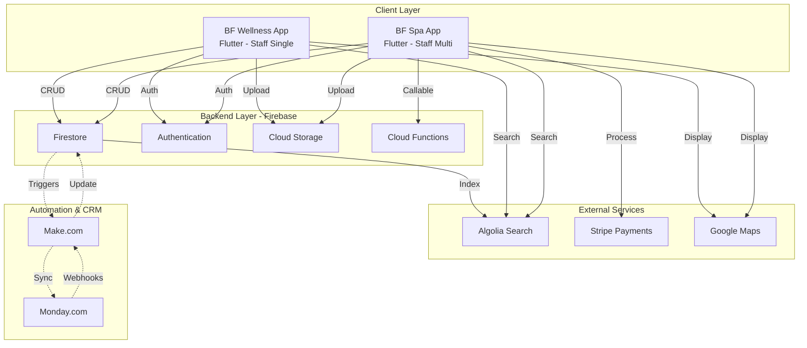
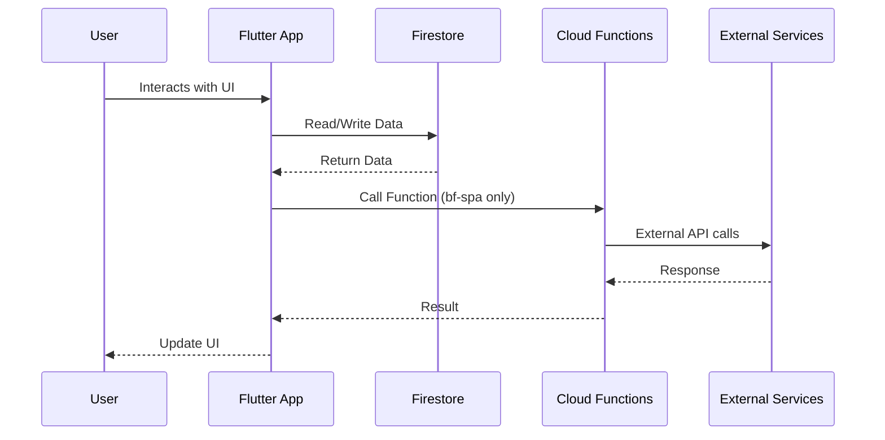
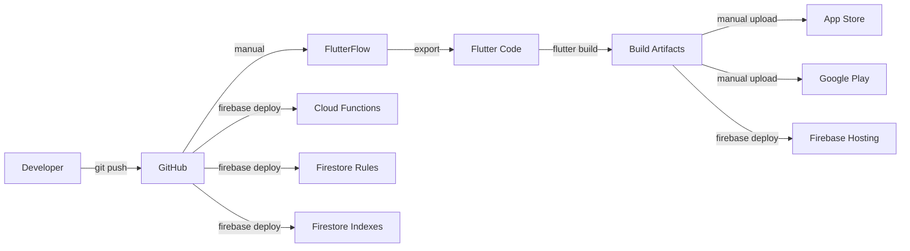

# Panoramica Architettura

Panoramica high-level dell'architettura del sistema BF Wellness.

## Architettura di Sistema



## Architecture Patterns

### 1. Client Architecture (Flutter)

**Pattern**: Model-View (FlutterFlow generated)

- **View**: `*_widget.dart` files - Pure UI
- **Model**: `*_model.dart` files - State & Logic
- **State Management**: Provider + FFAppState (global)
- **Navigation**: GoRouter (declarative routing)

### 2. Backend Architecture (Firebase)

**Pattern**: Serverless + BaaS (Backend as a Service)

- **Database**: Firestore (NoSQL document-based)
- **Auth**: Firebase Authentication (email, Google, Apple, Facebook, GitHub)
- **Storage**: Firebase Cloud Storage
- **Functions**: Cloud Functions (Node.js, europe-west3)

### 3. Data Flow



## Technology Stack

| Layer | Technology | Version |
|-------|-----------|---------|
| **Frontend** | Flutter | 3.27.2 |
| **Language** | Dart | 3.6.1 |
| **Code Gen** | FlutterFlow | Latest |
| **Database** | Cloud Firestore | 4.15.7 (bf-wellness)<br/>5.5.0 (bf-spa) |
| **Auth** | Firebase Auth | 4.17.7 / 5.3.3 |
| **Storage** | Firebase Storage | 11.6.8 / 12.3.2 |
| **Functions** | Cloud Functions | - / 5.1.5 |
| **Search** | Algolia | 1.1.1 |
| **Payments** | Stripe | - / 11.1.0 (bf-spa only) |
| **Maps** | Google Maps | 2.5.0 / 2.9.0 |
| **State** | Provider | 6.0.5 / 6.1.2 |
| **Navigation** | GoRouter | 7.1.1 / 12.1.3 |

<Warning>
  **Version Mismatch**: bf-wellness usa Firebase SDK 2.x, bf-spa usa 3.x.
  Considerare unificazione a 3.x per entrambe le app.
</Warning>

## Core Components

### Flutter Apps (Client)

<Tabs>
  <Tab title="bf-wellness">
    **Target**: Staff singola struttura
    **Version**: 1.0.3+4
    **Package**: `b_f_staff`

    **Features**:
    - Dashboard operativa
    - Booking management
    - Client management
    - Payment tracking (no Stripe)
    - Sales management
    - Algolia search

    **Platforms**: iOS, Android, macOS, Windows, Web
  </Tab>

  <Tab title="bf-spa">
    **Target**: Staff multi-struttura
    **Version**: 1.0.0+1
    **Package**: `bf_spa`

    **Features**:
    - Tutte le feature di bf-wellness +
    - Multi-accommodation support
    - Stripe integration
    - Training videos module
    - Second agenda booking
    - Firebase Crashlytics
    - Cloud Functions integration

    **Platforms**: iOS, Android, macOS, Windows, Web
  </Tab>
</Tabs>

### Firebase Backend

#### Firestore Database

**Collections**: 13 totali (10 comuni + 3 bf-spa exclusive)

- `users`, `clients`, `appointments`, `payments`, `workers`
- `products`, `service_categories`, `qualifications`, `sales`
- `accomodationServices`
- **bf-spa only**: `accomodations`, `accomodationWorkers`, `training_videos`

[Complete schema →](/api-reference/firestore-collections)

#### Security Model

**Rules Location**: `firebase/firestore.rules`

<Warning>
  **Critical Security Issue**: Molte collections hanno `allow read/create: if true` - accessibili senza autenticazione!

  [Fix consigliati →](/guides/security-rules)
</Warning>

#### Performance

**Indexes**:
- bf-wellness: 8 composite indexes
- bf-spa: 17 composite indexes

[Dettagli indexes →](/guides/firestore-indexes)

### External Integrations

#### Algolia Search

**Purpose**: Full-text search sui clienti
**Index**: `clients`
**Config**: Hardcoded in `lib/backend/algolia/algolia_manager.dart`

```dart
applicationId: 'JQA9QP4JNP'
apiKey: '3c3c7587c05000f81da86b8f4d3140ec'
```

#### Stripe (bf-spa only)

**Purpose**: Online payments
**Integration**: Cloud Functions `initStripePayment`, `initStripeTestPayment`
**SDK**: `flutter_stripe: 11.1.0`

#### Google Maps

**Purpose**: Location search, maps display
**Platform**: Google Maps Platform API

#### Monday.com (External)

**Purpose**: CRM e gestione operativa
**Integration**: Manuale o tramite Make.com
**Status**: Non automatizzata (richiede token API)

[Placeholder docs →](/api-reference/integrations/monday)

#### Make.com (External)

**Purpose**: Automazioni tra Firebase ↔ Monday.com
**Status**: Non documentato (richiede token API)

[Placeholder docs →](/api-reference/integrations/make)

## Key Architectural Decisions

### Why FlutterFlow?

**Pros**:
- ✅ Rapid UI development
- ✅ Cross-platform (iOS, Android, Web, Desktop)
- ✅ Firebase integration out-of-the-box
- ✅ Visual builder per stakeholders non-tecnici

**Cons**:
- ⚠️ Codice generato complesso
- ⚠️ Difficile customizzazione avanzata
- ⚠️ Lock-in parziale (hard to migrate away)

### Why Firebase?

**Pros**:
- ✅ Serverless (no infrastructure management)
- ✅ Real-time database
- ✅ Scalabile automaticamente
- ✅ Auth integration ottima
- ✅ Pay-as-you-go pricing

**Cons**:
- ⚠️ Vendor lock-in (Google)
- ⚠️ Query limitations (no joins, limited aggregations)
- ⚠️ Costs can grow with scale

### Why Two Separate Apps?

**Decisione strategica**: Separare app singola-struttura (bf-wellness) da multi-struttura (bf-spa)

**Rationale**:
- Complessità ridotta per clienti con singola sede
- Pricing differenziato
- Feature set specializzato

**Tradeoff**:
- ~90% codice duplicato
- Manutenzione doppia
- Rischio divergenza

**Alternativa futura**: Unificare in monorepo con feature flags

## Scalability Considerations

### Current State

- **Users**: < 100 concurrent users per app
- **Data**: < 1M documents total
- **Traffic**: Low to medium
- **Regions**: Primarily Italy (europe-west3)

### Bottlenecks Potenziali

1. **Firestore Read Operations**
   - Troppe read per schermata
   - Nessun caching client configurato
   - **Fix**: Implementare offline persistence Firestore

2. **Algolia Costs**
   - Search operations crescono linearmente con utenti
   - **Fix**: Cache search results, batch operations

3. **Image Storage**
   - No image optimization/resizing
   - Direct storage senza CDN
   - **Fix**: Cloud Functions per resize automatico

4. **Security Rules**
   - Troppo permissive (performance impact minimo)
   - Rischio sicurezza alto
   - **Fix**: Restriktive rules con auth checks

## Deployment Architecture



<Note>
  **No CI/CD configurato attualmente** - Tutti i deploy sono manuali

  Considerare GitHub Actions per automazione futura
</Note>

## Related Documentation

<CardGroup cols={2}>
  <Card title="Data Model" icon="database" href="/architecture/data-model">
    Firestore schema e data patterns
  </Card>

  <Card title="Authentication" icon="key" href="/architecture/authentication">
    Sistema autenticazione e provider
  </Card>

  <Card title="State Management" icon="gears" href="/architecture/state-management">
    FFAppState e Provider pattern
  </Card>

  <Card title="Integrations" icon="plug" href="/architecture/integrations">
    Firebase, Algolia, Stripe, Monday, Make
  </Card>
</CardGroup>
