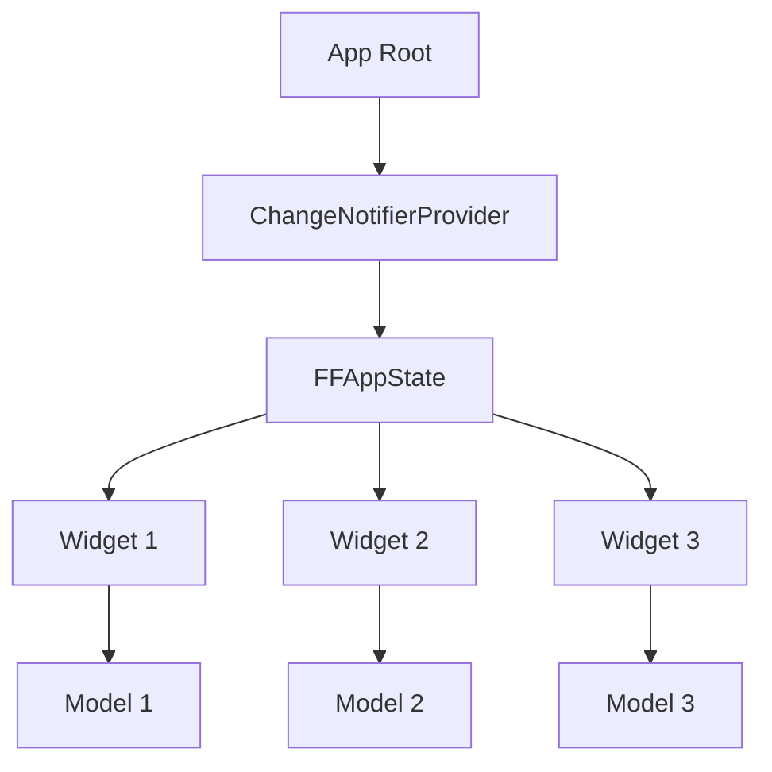
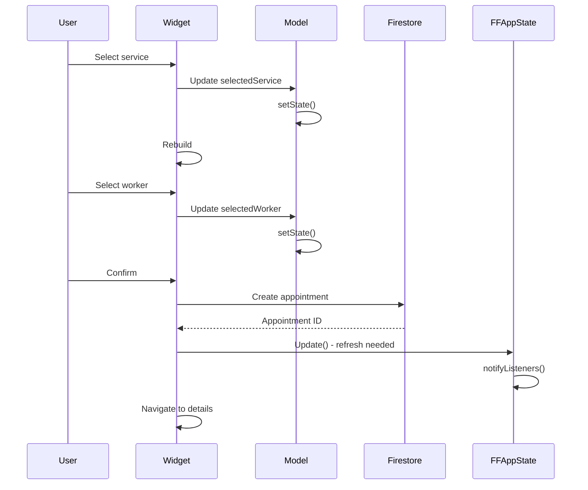

# Gestione dello Stato

Sistema di gestione stato nel progetto BF Wellness.

## Overview

**Primary Pattern**: Provider + FlutterFlow Models
**Global State**: FFAppState (ChangeNotifier + SharedPreferences)
**Local State**: Widget Models (FlutterFlowModel<T>)

## Architecture



## FFAppState (Global)

**File**: `lib/app_state.dart`

### bf-wellness State

```dart
class FFAppState extends ChangeNotifier {
  // Persisted
  bool _firstLogin = true;         // Primo accesso app
  dynamic _currentLocation;        // Posizione GPS corrente

  // Non persisted
  int _currentNavIndex = 0;        // Tab navigation attiva

  // Getters
  bool get firstLogin => _firstLogin;
  dynamic get currentLocation => _currentLocation;
  int get currentNavIndex => _currentNavIndex;

  // Update (notifies listeners)
  void update(VoidCallback callback) {
    callback();
    notifyListeners();
  }
}
```

### bf-spa State (Extended)

```dart
class FFAppState extends ChangeNotifier {
  // Same as bf-wellness +

  // Persisted
  AccommodationWorkerDataStruct _selectedAccomodation;

  // Non persisted
  ClientDataStruct _userData;

  // Additional getters/setters
}
```

### Usage

```dart
// Read
final firstLogin = FFAppState().firstLogin;
final navIndex = FFAppState().currentNavIndex;

// Write
FFAppState().update(() {
  FFAppState().currentNavIndex = 2;
  FFAppState().firstLogin = false;
});

// Listen to changes
Provider.of<FFAppState>(context).currentNavIndex;
```

## Widget Models (Local)

**Pattern**: One model per widget

### Structure

```dart
class ExampleModel extends FlutterFlowModel<ExampleWidget> {
  // Controllers
  TextEditingController? searchController;
  FocusNode? searchFocusNode;

  // Sub-models
  late NavBarModel navBarModel;

  // State
  List<ClientsRecord>? clients;
  bool isLoading = false;

  @override
  void initState(BuildContext context) {
    navBarModel = createModel(context, () => NavBarModel());
  }

  @override
  void dispose() {
    searchController?.dispose();
    searchFocusNode?.dispose();
    navBarModel.dispose();
  }
}
```

### Usage

```dart
class ExampleWidgetState extends State<ExampleWidget> {
  late ExampleModel _model;

  @override
  void initState() {
    super.initState();
    _model = createModel(context, () => ExampleModel());

    // Initialize controllers
    _model.searchController ??= TextEditingController();
  }

  @override
  Widget build(BuildContext context) {
    return TextField(
      controller: _model.searchController,
      onChanged: (value) {
        setState(() {
          _model.isLoading = true;
        });
        // ... fetch data
      },
    );
  }
}
```

## Persistence

**Mechanism**: SharedPreferences

**Persisted Fields**:
- `firstLogin`
- `currentLocation`
- `selectedAccomodation` (bf-spa only)

**Initialization**:

```dart
// main.dart
final appState = FFAppState();
await appState.initializePersistedState();
```

**Implementation**:

```dart
Future initializePersistedState() async {
  prefs = await SharedPreferences.getInstance();
  _firstLogin = prefs.getBool('ff_firstLogin') ?? true;
  _currentLocation = prefs.getString('ff_currentLocation')?.let(jsonDecode);
}

void update(VoidCallback callback) {
  callback();
  notifyListeners();
  // Persist to SharedPreferences
  prefs.setBool('ff_firstLogin', _firstLogin);
  prefs.setString('ff_currentLocation', jsonEncode(_currentLocation));
}
```

## Provider Integration

**Setup** in `main.dart`:

```dart
void main() async {
  // ...
  final appState = FFAppState();
  await appState.initializePersistedState();

  runApp(
    ChangeNotifierProvider(
      create: (context) => appState,
      child: MyApp(),
    ),
  );
}
```

**Access** anywhere:

```dart
// With context
final appState = Provider.of<FFAppState>(context);
final appState = context.watch<FFAppState>();  // Rebuilds on change
final appState = context.read<FFAppState>();   // No rebuild

// Without context
FFAppState().property;
```

## Best Practices

<AccordionGroup>
  <Accordion title="Use FFAppState for Truly Global Data">
    **Good**: User preferences, current location, navigation state
    **Bad**: Temporary UI state, form data, search results

    ```dart
    // ✅ GOOD - Truly global
    FFAppState().update(() {
      FFAppState().currentNavIndex = 1;
    });

    // ❌ BAD - Should be in Model
    FFAppState().update(() {
      FFAppState().searchResults = results;
    });
    ```
  </Accordion>

  <Accordion title="Always Use update() Method">
    ```dart
    // ✅ GOOD - Notifies listeners
    FFAppState().update(() {
      FFAppState().firstLogin = false;
    });

    // ❌ BAD - No notification
    FFAppState()._firstLogin = false;
    ```
  </Accordion>

  <Accordion title="Dispose Controllers in Models">
    ```dart
    @override
    void dispose() {
      textController?.dispose();
      focusNode?.dispose();
      subModel.dispose();
      super.dispose();
    }
    ```

    Memory leaks se non disposti!
  </Accordion>

  <Accordion title="Use createModel() for Sub-Models">
    ```dart
    // ✅ GOOD - Gestisce lifecycle
    navBarModel = createModel(context, () => NavBarModel());

    // ❌ BAD - Memory leak
    navBarModel = NavBarModel();
    ```
  </Accordion>
</AccordionGroup>

## State Flow Example

### Booking Creation Flow



## When to Use What?

| Scenario | Use |
|----------|-----|
| Navigation tab | FFAppState |
| User preferences | FFAppState (persisted) |
| Current location | FFAppState (persisted) |
| Selected accommodation | FFAppState (persisted, bf-spa) |
| Form input | Model |
| Search results | Model |
| Loading states | Model |
| Temporary UI state | Model |
| Sub-component state | Sub-Model (via createModel) |

## Related

<CardGroup cols={2}>
  <Card title="Flutter State Management" icon="react" href="https://flutter.dev/docs/development/data-and-backend/state-mgmt/intro">
    Flutter official docs
  </Card>

  <Card title="Provider Package" icon="box" href="https://pub.dev/packages/provider">
    Provider package docs
  </Card>
</CardGroup>
