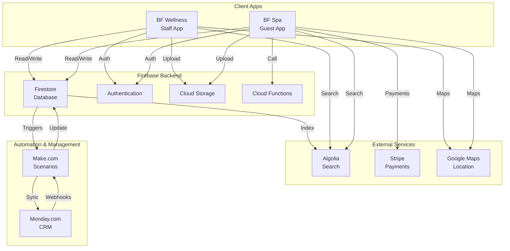

# Panoramica del progetto BF Wellness

Questa documentazione descrive l’ecosistema digitale **BF Wellness**, nato per gestire l’operatività delle strutture BF e l’esperienza degli ospiti. L’ecosistema è composto da due applicazioni Flutter correlate e alimentate dallo stesso backend Firebase:

- `bf-wellness` – applicazione desktop/mobile destinata a **staff di reception e operatori di SPA** per coordinare clienti, prenotazioni, vendite e incassi.
- `bf-spa` – applicazione web/mobile dedicata agli **ospiti** che consente di scoprire trattamenti, prenotare servizi e gestire pagamenti.

Entrambe le app sono esportate da FlutterFlow e condividono gran parte dello stack (Flutter 3, Firebase, Algolia, Stripe, Google Maps). Questo manuale funge da **source of truth** per chi deve continuare lo sviluppo o la manutenzione del progetto.

## Componenti dell'Ecosistema

BF Wellness è un ecosistema digitale completo per la gestione di strutture wellness e SPA, composto da:

- **BF Wellness (Staff App)** - Applicazione desktop/mobile per staff di reception e operatori
- **BF Spa (Guest App)** - Applicazione web/mobile per ospiti e clienti
- **Firebase Backend** - Database, autenticazione, storage e cloud functions
- **Monday.com** - Sistema CRM e gestione operativa (24 boards sincronizzate)
- **Make.com** - Piattaforma automazione e workflow (8 scenari attivi)
- **Altre Integrazioni** - Algolia (ricerca), Stripe (pagamenti), Google Maps

## Architettura dell'Ecosistema

## Struttura della documentazione

- **Panoramica e modello dati**: visione macro e dettagli sulle principali collezioni Firestore condivise.
- **Componenti e linee guida Flutter**: come è strutturato il codice generato da FlutterFlow, dove intervenire in sicurezza e come estendere l’app.
- **Documentazione applicativa**: una sezione dedicata a ciascuna app con architettura, flussi funzionali, personalizzazioni e check-list operative.
- **Operatività**: istruzioni per ambienti locali, distribuzione e gestione dei servizi collegati (Firebase, Stripe, Algolia).
- **Asset digitali**: informazioni su sito istituzionale e strumenti gestionali esterni.

Tutti i contenuti sono in lingua italiana e vengono aggiornati per riflettere lo stato del repository. Ogni pagina include collegamenti incrociati per fornire contesto e guidare l’approfondimento.

## Asset complementari

- **Sito istituzionale** – ospitato su SiteGround con WordPress (`https://bfwellness.it/`, alias `https://brunoferrera.com/`). Raccoglie contenuti marketing e funge da punto d’ingresso per ospiti e partner.
- **Gestionale Monday.com** – workspace organizzativo dove lo staff traccia attività operative, roadmap, richieste e stati di avanzamento. Il gestionale non è ancora integrato programmaticamente con Firebase ma rappresenta la fonte di verità per pianificazione e priorità di prodotto; eventuali sincronizzazioni manuali devono mantenere coerenza con le collezioni Firestore, soprattutto per pianificazione trattamenti e campagne marketing. Maggiori dettagli nella pagina [Gestionale Monday.com](monday).
- **Codice sorgente** – repository privati su GitHub gestiti dal team BF Wellness. La pagina [Sorgente e versioning](source-control) indica convenzioni di branching, protezione credenziali e riferimenti agli ambienti.

Nel prosieguo della documentazione verranno fornite istruzioni dettagliate su accessi, board e automazioni Monday.com non appena disponibili.
