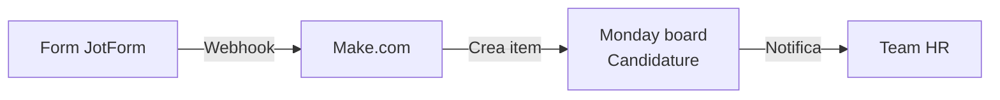

Queste indicazioni coprono la gestione quotidiana del sito, dal rilascio di contenuti agli aggiornamenti tecnici.

## Flusso di aggiornamento

<Columns cols={2}>
  <Card title="Contenuti" icon="pen-to-square">
    - Aggiornare testi e sezioni via Elementor.
    - Documentare la modifica nel board Monday.
    - Verificare live il rendering desktop/mobile.
  </Card>
  <Card title="Struttura / plugin" icon="puzzle-piece">
    - Utilizzare Site Tools → Gestione WordPress oppure SFTP.  
    - Annotare plugin aggiornati e versione in Monday.  
    - Eseguire backup manuale prima di aggiornamenti major.
  </Card>
</Columns>

<Checklist>
  <ChecklistItem>Prima di aggiornare plugin, replicare in staging.</ChecklistItem>
  <ChecklistItem>Controllare compatibilità PHP/WordPress con tema e plugin.</ChecklistItem>
  <ChecklistItem>Monitorare performance (SiteGround Optimizer, PageSpeed Insights).</ChecklistItem>
</Checklist>

## Backup e restore

- SiteGround crea backup automatici giornalieri (retention 30 giorni).
- Ripristino: Site Tools → Sicurezza → Backup → "Ripristina".
- Per release importanti: creare snapshot manuale e documentare l'ID.

## Staging e promozione

<Steps>
  <Step title="Clona in staging">
    Site Tools → WordPress → Staging → “Crea copia”. Seleziona file + database.
  </Step>
  <Step title="Test">
    Aggiorna plugin/tema, verifica form, pagine critiche, performance.
  </Step>
  <Step title="Push to live">
    Usa “Push to Live”, includendo solo file/db necessari.  
    Verifica produzione, svuota cache SG Optimizer.
  </Step>
  <Step title="Documenta">
    Documenta esito, problemi riscontrati e prossimi step.
  </Step>
</Steps>

## Form candidature e JotForm

Il sito utilizza **JotForm** per il form di candidatura della pagina "Lavora con noi".

<Card title="Form Candidature" icon="clipboard-list">
  **Pagina**: [bfwellness.it/jobs/](https://bfwellness.it/jobs/)

  **Integrazione**:
  - Form embedded tramite JotForm
  - Webhook automatico verso Make.com
  - Sincronizzazione con Monday board "Candidature"

  **Link rapido**: [JotForm Dashboard](https://www.jotform.com/)
</Card>

<Note>
**Nota tecnica**: L'URL esatto del form JotForm può essere recuperato dall'embed code nella pagina WordPress. Per modificare il form o configurare il webhook, accedere al pannello JotForm con le credenziali del responsabile IT.
</Note>

### Flusso integrazione candidature

## Gestione listini via FTP

I listini prezzi delle strutture vengono caricati sul server tramite **FTP/SFTP** e poi collegati alle pagine WordPress.

<Steps>
  <Step title="Genera credenziali SFTP">
    Accedi a **SiteGround Site Tools** → Strumenti sito → Gestione FTP

    Genera credenziali temporanee o utilizza quelle esistenti.
  </Step>

  <Step title="Connetti via SFTP">
    Utilizza un client SFTP (FileZilla, Cyberduck, WinSCP) con:
    - **Host**: Host SiteGround della struttura
    - **Username**: Generato da Site Tools
    - **Password**: Generata da Site Tools
    - **Porta**: 22 (SFTP)
  </Step>

  <Step title="Carica file listino">
    Naviga nella cartella dedicata ai listini sul server.

    <Warning>
    **Cartella da verificare**: Il percorso esatto della cartella listini non è attualmente documentato. Verificare con il responsabile IT o controllare la struttura directory sul server.

    Percorsi comuni:
    - `/public_html/listini/`
    - `/public_html/wp-content/uploads/listini/`
    - `/public_html/assets/listini/`
    </Warning>

    Carica il file PDF del listino seguendo la naming convention aziendale.
  </Step>

  <Step title="Aggiorna Monday board Listini">
    Accedi al board Monday "Listini" e:
    - Aggiorna campo "Listino PDF" con link al file caricato
    - Verifica date validità (Inizio/Fine)
    - Collega alla struttura di riferimento
  </Step>

  <Step title="Pubblica su WordPress">
    Aggiorna le pagine WordPress delle strutture collegando il nuovo listino PDF.

    Verifica che il link sia funzionante e il download avvenga correttamente.
  </Step>
</Steps>

<Note>
**Sincronizzazione**: I listini caricati via FTP devono essere manualmente collegati sia al board Monday "Listini" che alle pagine WordPress. Non esiste attualmente una sincronizzazione automatica.

Per maggiori informazioni sul board Monday, consulta la documentazione [Gestionale Monday.com](../monday).
</Note>
