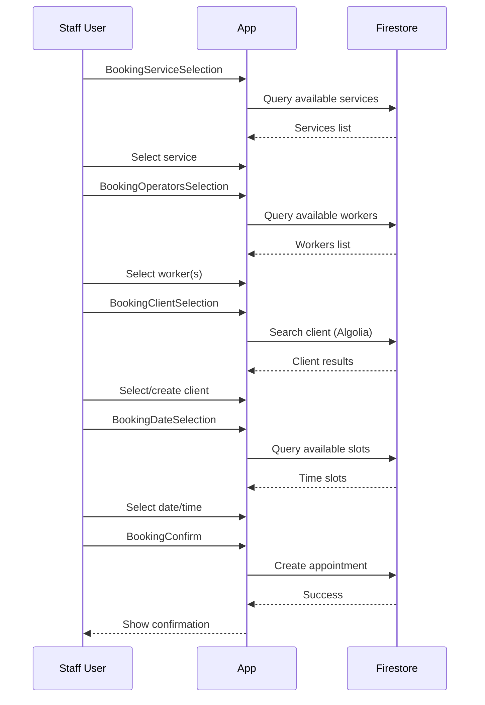

# Creare una Prenotazione

Flusso completo per creare una nuova prenotazione.

## User Flow

## Screens Involved

1. `BookingServiceSelectionWidget`
2. `BookingOperatorsSelectionWidget`
3. `BookingClientSelectionWidget`
4. `BookingDateSelectionWidget`
5. `BookingConfirmWidget`

## Code Reference

**Location**: `apps/bf-wellness/lib/screens/booking/`

[Complete implementation guide TBD]
