# Panoramica Funzionalità

Questa sezione documenta le **funzionalità principali** dell'ecosistema BF Wellness, con focus sui flussi utente, logica di business e implementazione tecnica.

## Funzionalità Disponibili

BF Wellness offre **4 aree funzionali principali**:

<CardGroup cols={2}>
  <Card title="Sistema Prenotazioni" icon="calendar-check" href="/features/booking/overview">
    Gestione completa prenotazioni trattamenti

    **Operazioni**:
    - Creazione prenotazione
    - Modifica data/ora/operatori
    - Cancellazione
    - Gestione calendario
    - Slot availability

    **Collection Firestore**: `/appointments`
  </Card>

  <Card title="Gestione Clienti" icon="users" href="/features/clients/overview">
    Anagrafica e gestione clienti/ospiti

    **Operazioni**:
    - CRUD clienti
    - Ricerca full-text (Algolia)
    - Storico prenotazioni
    - Gestione documenti
    - Check-in/Check-out (bf-spa)

    **Collection Firestore**: `/clients`
  </Card>

  <Card title="Sistema Pagamenti" icon="credit-card" href="/features/payments/overview">
    Registrazione pagamenti e integrazione Stripe

    **Operazioni**:
    - Registrazione pagamento (cash, card, bonifico)
    - Pagamento online Stripe (bf-spa only)
    - Tracking saldo cliente
    - Applicazione sconti
    - Receipt generation

    **Collection Firestore**: `/payments`
  </Card>

  <Card title="Gestione Vendite" icon="shopping-cart" href="/features/sales/overview">
    Vendita prodotti e servizi

    **Operazioni**:
    - Vendita diretta prodotti
    - Gestione catalogo
    - Tracking inventory
    - Registro vendite
    - Sincronizzazione Monday.com

    **Collection Firestore**: `/sales`
  </Card>
</CardGroup>

## Matrice Funzionalità per App

Le funzionalità sono distribuite diversamente tra le due app:

| Funzionalità | BF Wellness (Staff) | BF Spa (Guest) |
|--------------|---------------------|----------------|
| **Prenotazioni** |  |  |
| - Creare prenotazione | ✅ | ✅ (self-service) |
| - Modificare prenotazione | ✅ | ✅ (limitata) |
| - Cancellare prenotazione | ✅ | ✅ |
| - Visualizzare calendario | ✅ | ❌ |
| - Assegnare operatori | ✅ | ❌ |
| **Clienti** |  |  |
| - Creare cliente | ✅ | ✅ (registrazione) |
| - Modificare anagrafica | ✅ | ✅ (solo propria) |
| - Ricerca clienti | ✅ (tutti) | ❌ |
| - Check-in/Check-out | ❌ | ✅ |
| - Storico prenotazioni | ✅ (tutti clienti) | ✅ (solo proprie) |
| **Pagamenti** |  |  |
| - Registrare pagamento | ✅ | ❌ |
| - Pagamento online Stripe | ❌ | ✅ |
| - Visualizzare saldo | ✅ | ✅ (solo proprio) |
| - Applicare sconti | ✅ | ❌ |
| **Vendite** |  |  |
| - Vendita prodotti | ✅ | ❌ |
| - Catalogo prodotti | ✅ | ✅ (visualizzazione) |
| - Registro vendite | ✅ | ❌ |

## Flussi Utente Principali

### 1. Flusso Prenotazione (Staff → BF Wellness)

```mermaid
sequenceDiagram
    participant Staff
    participant App
    participant Firestore
    participant Monday

    Staff->>App: Apre "Crea Prenotazione"
    App->>Firestore: Carica clienti disponibili
    Staff->>App: Seleziona cliente/servizio/data
    App->>Firestore: Verifica slot disponibili
    App-->>Staff: Mostra slot liberi
    Staff->>App: Conferma prenotazione
    App->>Firestore: Crea documento `/appointments`
    Firestore-->>App: Success
    App->>Monday: Trigger Make.com sync
    App-->>Staff: ✅ Prenotazione creata
```



[Dettagli →](/features/booking/create-booking)

### 2. Flusso Prenotazione (Guest → BF Spa)

```mermaid
sequenceDiagram
    participant Guest
    participant App
    participant Firestore
    participant Stripe

    Guest->>App: Naviga catalogo servizi
    Guest->>App: Seleziona trattamento
    App->>Firestore: Carica disponibilità
    App-->>Guest: Mostra calendario
    Guest->>App: Sceglie data/ora
    Guest->>App: Conferma e paga
    App->>Stripe: Processo pagamento
    Stripe-->>App: Payment success
    App->>Firestore: Crea `/appointments` + `/payments`
    App-->>Guest: ✅ Prenotazione confermata
```



[Dettagli →](/features/booking/create-booking)

### 3. Flusso Pagamento con Stripe (BF Spa)

```mermaid
sequenceDiagram
    participant Guest
    participant App
    participant CloudFunction
    participant Stripe
    participant Firestore

    Guest->>App: Clicca "Paga"
    App->>CloudFunction: initStripePayment(amount)
    CloudFunction->>Stripe: Create PaymentIntent
    Stripe-->>CloudFunction: client_secret
    CloudFunction-->>App: Return secret
    App->>Stripe: Present payment sheet
    Guest->>Stripe: Inserisce card
    Stripe-->>App: Payment confirmed
    App->>Firestore: Salva `/payments` doc
    App-->>Guest: ✅ Pagamento completato
```



[Dettagli →](/features/payments/stripe-integration)

## Pattern di Implementazione Comuni

### Pattern 1: CRUD con FlutterFlow

Tutte le features seguono il pattern **Widget + Model**:

```dart
// Widget: UI Component
class BookingCreateWidget extends StatefulWidget {
  // ...
}

// Model: Business Logic
class BookingCreateModel extends FlutterFlowModel {
  // State variables
  ClientsRecord? selectedClient;
  ServicesRecord? selectedService;
  DateTime? selectedDate;

  // Methods
  Future<void> createBooking() async {
    await AppointmentsRecord.collection.doc().set({
      'client': selectedClient?.reference,
      'service': selectedService?.reference,
      'startDate': selectedDate,
      // ...
    });
  }
}
```

### Pattern 2: Data Denormalization

Per performance, i dati vengono **denormalizzati** nelle prenotazioni:

```dart
// ❌ BAD: Solo reference (richiede join)
{
  "client": DocumentReference("/clients/abc123")
}

// ✅ GOOD: Snapshot con dati essenziali
{
  "client": DocumentReference("/clients/abc123"),
  "clientData": {
    "name": "Mario",
    "surname": "Rossi",
    "email": "mario@example.com"
  }
}
```

Questo permette di visualizzare dati senza query aggiuntive.

### Pattern 3: Real-time Updates con StreamBuilder

```dart
StreamBuilder<List<AppointmentsRecord>>(
  stream: queryAppointmentsRecord(
    queryBuilder: (q) => q
        .where('accomodation', isEqualTo: currentAccomodation)
        .where('startDate', isGreaterThan: DateTime.now())
        .orderBy('startDate'),
  ),
  builder: (context, snapshot) {
    if (!snapshot.hasData) return CircularProgressIndicator();

    final appointments = snapshot.data!;
    return ListView.builder(
      itemCount: appointments.length,
      itemBuilder: (context, index) {
        return AppointmentCard(appointment: appointments[index]);
      },
    );
  },
)
```

## Sincronizzazione con Monday.com

Molte features hanno **sincronizzazione bidirezionale** con Monday.com via Make.com:

| Feature | Collection Firestore | Board Monday.com | Direzione Sync |
|---------|---------------------|------------------|----------------|
| Prenotazioni | `/appointments` | "Prenotazioni" (ID: 1175245999) | ↔️ Bi-direzionale |
| Clienti | `/clients` | "Anagrafiche" (ID: 1175215967) | ↔️ Bi-direzionale |
| Operatori | `/workers` | "Staff" (ID: 1175246540) | ↔️ Bi-direzionale |
| Vendite | `/sales` | "Registro vendite" (ID: 1179900511) | → Monday only |
| Pagamenti | `/payments` | - | ❌ No sync |

[Dettagli integrazione →](/api-reference/integrations/monday)

## Stati delle Sezioni

<Warning>
  Molte pagine in questa sezione sono attualmente in costruzione (🚧 WIP).

  Contengono documentazione di base ma necessitano espansione con:
  - Dettagli implementativi
  - Esempi codice completi
  - Screenshot UI
  - Test cases
</Warning>

### Completezza Attuale

| Sezione | Completezza | Note |
|---------|-------------|------|
| [Prenotazioni](/features/booking/overview) | 30% | Overview e flussi base presenti |
| [Clienti](/features/clients/overview) | 25% | CRUD e ricerca documentati |
| [Pagamenti](/features/payments/overview) | 20% | Stripe integration parziale |
| [Vendite](/features/sales/overview) | 15% | Solo overview base |

## Prossimi Passi

Per espandere questa documentazione:

1. **Aggiungere Screenshot**: UI screens per ogni flusso
2. **Esempi Codice Completi**: Snippet copy-paste ready
3. **Test Cases**: Scenari di test per ogni feature
4. **Video Tutorial**: Walkthrough delle features principali
5. **API Examples**: Esempi query Firestore comuni

## Domande Frequenti

<AccordionGroup>
  <Accordion title="Come aggiungo una nuova feature?">
    1. Definisci data model in Firestore
    2. Crea UI in FlutterFlow (o custom Flutter)
    3. Implementa business logic nel Model
    4. Configura security rules
    5. Setup sincronizzazione Monday.com (se necessario)
    6. Documenta nella sezione Features

    [Guida completa →](/getting-started/first-contribution)
  </Accordion>

  <Accordion title="Dove trovo gli esempi di query Firestore?">
    Gli esempi di query per ogni collection sono in [Riferimento Collections Firestore](/api-reference/firestore-collections).

    Ogni collection ha:
    - Schema completo
    - Esempio JSON
    - Security rules
    - Query helpers comuni
  </Accordion>

  <Accordion title="Come funziona la sincronizzazione Monday.com?">
    La sincronizzazione è gestita da **Make.com scenarios**:

    1. Firestore trigger (onCreate/onUpdate)
    2. Make.com processa evento
    3. Crea/aggiorna item su Monday.com board
    4. Webhook Monday → Make → Firestore (direzione opposta)

    [Dettagli completi →](/api-reference/integrations/make)
  </Accordion>

  <Accordion title="bf-wellness e bf-spa condividono codice?">
    Sì, circa **90% del codice è condiviso**:
    - Stesse collections Firestore (bf-spa ne ha 3 in più)
    - Stessa architettura Widget/Model
    - Stesso pattern di state management

    **Differenze**:
    - bf-spa ha multi-accommodation support
    - bf-spa ha Stripe integration
    - bf-wellness ha features staff-only

    [Confronto dettagliato →](/technical-specs/bf-wellness-vs-bf-spa)
  </Accordion>
</AccordionGroup>

---

<Info>
  **Prossimo Passo**: Esplora una feature specifica iniziando da [Sistema Prenotazioni](/features/booking/overview).
</Info>
