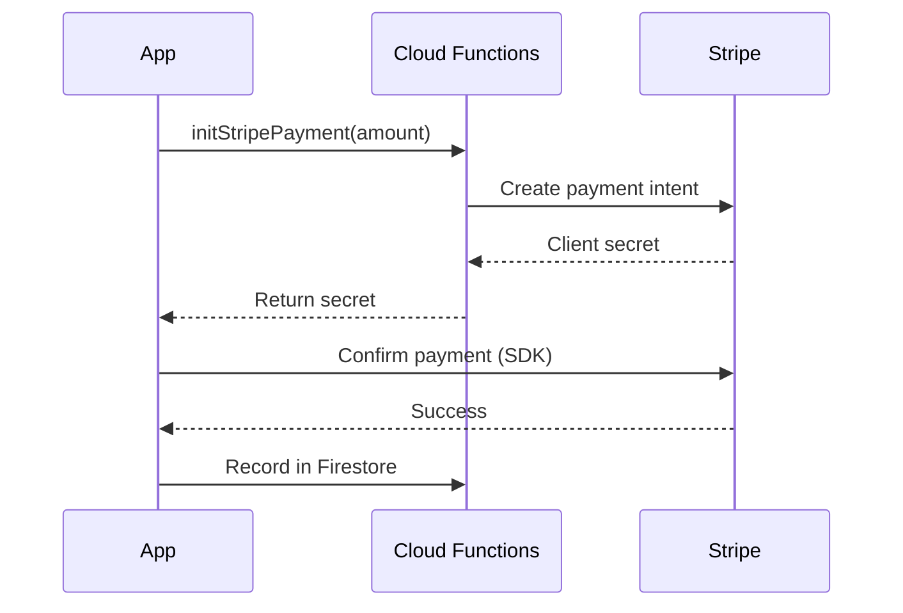

# Integrazione Stripe

**App**: bf-spa only

## Architecture



## Cloud Function

[Details →](/api-reference/cloud-functions#initstripepayment)

## Flutter Implementation

```dart
// Call Cloud Function
final callable = FirebaseFunctions.instance
  .httpsCallable('initStripePayment');
final result = await callable.call({'amount': 10000});

// Use Stripe SDK
await Stripe.instance.initPaymentSheet(
  paymentSheetParameters: SetupPaymentSheetParameters(
    paymentIntentClientSecret: result.data['clientSecret'],
    merchantDisplayName: 'BF Wellness',
  ),
);

await Stripe.instance.presentPaymentSheet();
```

[Complete setup guide TBD]
